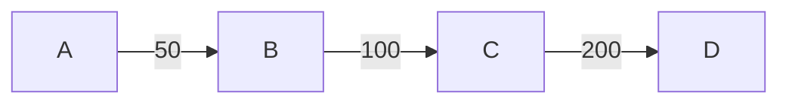
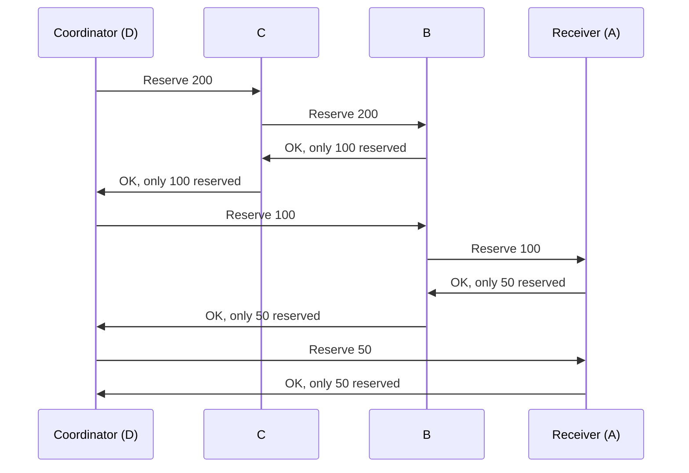
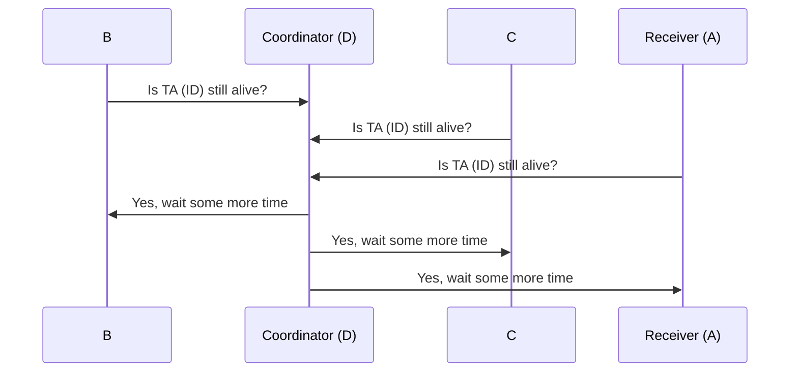
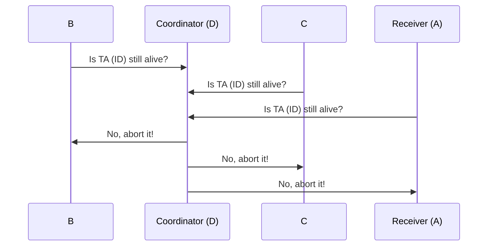
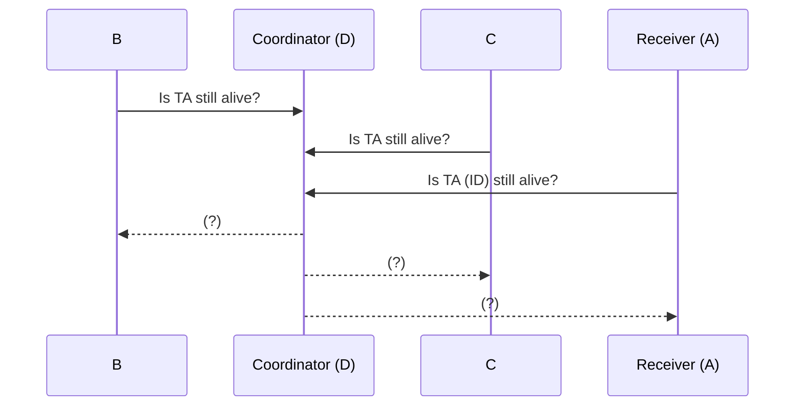
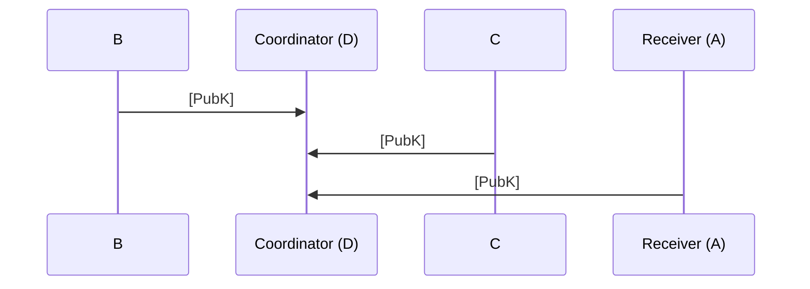

`GEO Protocol / 2018`  `DRAFT [todo: remove it]`


Fast, safe, double-spending resistant, multi-attendee crypto-protocol  
for atomic and consistent assets transfers.
<br/>
<br/>
<br/>
[`Max Demiyan`](https://github.com/MaxDemyan)
[`Dima Chizhevsky`](https://github.com/haysaycheese/) 
[`Mykola Ilashchuk`](https://github.com/MukolaIlashchuk) 
<br/>
<br/>
**Contributors:**
[`Denis Vasilov`](https://github.com/Vasilov345)
<br/>
<br/>
<br/>
<br/>
<br/>
<br/>
# Abstract
This specification describes transactions processing algorithm (Algorithm further in the doc) for the [GEO](https://github.com/GEO-Project) network.  
Proposed solution provides ability for up to 1024 network participants [※ 1] to achieve 100% consensus via potentially unstable network, in untrusted environment and under active fraud attempts of malicious participants.

<br/>
※ potentially much more.

# Overview
The objectives of this document are:
1. to provide comprehensive info about proposed method of consensus;
1. to describe [guaranteed double spending impossibility](https://github.com/GEO-Project/specs-protocol/blob/master/transactions/transactions.md#double-spending-prevention), and distributed locks mechanics;
1. to describe the [cryptographic primitives used](https://github.com/GEO-Project/specs-protocol/blob/master/transactions/transactions.md#cryptographic-primitives) and the provide motivation for including each of them into the protocol;
1. to describe the method of mathematical and cryptographic confirmation of operations (consensus checking);
1. to prodive mathematical confirmation of the impossibility (or extreme complexity) of the operations compromising;
1. to provide a list of possible edge cases and to describe the ways to avoid/resovle them, as well as possible outcomes of operations.

# Source conditions and requirements
This section lists the functional and design requirements for the proposed algorithm — the metrics, that were used to analyze all found and potentially applicable solutions for their applicability in the final protocol.

**1. Requirements for cryptographic primitives:**
  1. _Quantum-resistant cryptography._  
  Algorithm must be avare of usage of cryptographic solutions, which are potentially [easily compromised in quantum-based environment](https://csrc.nist.gov/Projects/Post-Quantum-Cryptography) (RSA / ECDSA, and other solutions that are based on similar mathematical problems).  
  
  1. _Strict minimum of crypto-primitives._  
  Algorithm must use strict minimum of the crypto systems. The role of each of them must be strictly defined and clearly motivated. 
  
**2. Requirements for operations:**
   1. _Strict 100% consensus._  
   Algorithm must enforce achievement of 100% consensus (with possibility of subsequent verification of it) between all  participants involved: the operation itself must be considered as conducted only if all participants (nodes) has approved it. Otherwise - operation must be cancelled also on all participants devices. Achieved consensus must be mathematically approvable and verifieble by any participant of the operation.
   
  1. _Deferred atomicity._  
  For each one operations launched in the network, all nodes involved in it, must achieve final state, or discard the operation at all. Intermediate states are acceptable only in short period of time, but are unacceptable to be permanent. Achieving atomicity should be:
    1. time-predictable (ideally about a few seconds).
    1. safe towards other operations (launched in parallel).
    1. agnostic towards nodes internal code modifications (hacking) and destructive motivation of the involved participants (fraud attempts).
    
  1. _Predicted time window._    
  Transaction time window — `1-15` seconds for non-fraud operations, and up to `~20 minutes` [#6] for processing problematic operations. It is expected, that more than 90% of all operations in the network would be non-fraud. This assumption is only related to the estimated network throughput.

  1. _Routes agnostic._
  Transactions must be able to use up to several hundreds of different payment paths. [# todo: provide link to the Routing specification].

  1. _Token / Commisions independence._  
  Transactions must be able to proceed without any internal token. Participants must not be enforced to charge any commissions for the middle ware operations processing.


**3. Requirements for end-point devices (nodes):**
  1. _Applicability for modern smartphones._  
  Algorithm should be usable in environments with limited computing resources and memory. Operations that consume a large amount of resources (for example, operations with significant number of participants), should be easy to process partially (pipelining).
  
  1. _Computational efficiency._  
  Algorithm should have low computational complexity. The mechanism for achieving consensus must avoid frequent calling of complex cryptographic operations (as, for example, Proof Of Work mechanics assumes in some blockchain-based solutions).
  
**4. Requirements for anonymity of operations:**
  1. _Network addressation agnostic._  
  Algorithm must be agnostic on addressation mechanics, so the participants might be present by any kind of addresses (IP / any kind of name resolutions services / prosy services, etc). As a consequence - algorithm should support anonimization via tor and other similar networks.
  
  1. _Lack of a common ledger and common operations history._
  The outcome of the operation must be determined and distributed only within the participants of this operation. The remaining nodes of the network, who do not participate in the operation, must not be able to retrieve the data about operation, and/or its content.
  
**5. Requirements for network resources:**
  1. _Resistance to unstable networks._  
  Algorithm is resistant to network interference, packet loss and/or even whole messages loss. In the worst case, if consensus can't be reached, the operation must be canceled on all devices participating in it.
  
  1. _Transport protocol agnostic._  
  Algorithm must not require a permanent connection and must not base its own mechanics on the guarantees provided by different protocols, starting with the transport layer of the OSI model (for example, TCP). The reference implementation of the algorithm is based on UDP (see network protocol specifications for the details) [※ 1].
  
**6. Requirements for fault tolerance:**
  1. _Strict operation completion guarantee_  
  Algorithm in conjunction with the rest of the GEO protocol ecosystem solutions, must be ablr to ensure the finality of any running operation on the network. Scenarios under which the operation was started, but can not be completed (dead locks) must be striclty documnted and excluded.
  
  1. _Automatic synchronization._  
  Algorithm must be able to automatically resolve possible conflicts between participants of the network, leading them back to the synchronization state, via strit logic of cryptographically-based solutions.
  
  
**7. Requirements for the speed of operations:**
  1. _Sub-second processing time for one participant._  
  This point depends very much on the configuration of the separately taken node, but in general, the GEO Protocol team aims to create an algorithm that is as effective in time as possible. This approach is reflected in a number of optimizations adopted in the algorithm, and continues to find a place in the new solutions.
  
**8. Requirements for portability:**
  1. The algorithm must not contain platform-dependent components.
  1. The algorithm must not be hardware specific or dependent.
  
  
※ To increase the probabilty of achieving consensus, and / or shorten the time of the algorithm execution, various traffic optimisation and correction techniques can be used as well. This protocol does not assumes any of them to be present, but obviously works better in the environments with stable network connections.


# Cryptographic primitives
This section describes the used cryptographic primitives and the motivation for their inclusion in the protocol.

## Lamport Signature
[_Lamport signature_](https://en.wikipedia.org/wiki/Lamport_signature) or _Lamport one-time signature scheme_ is a method for constructing a digital signature. Lamport signatures can be built from any cryptographically secure one-way function; usually a cryptographic hash function is used [※ 1]. In Twin Spark, Lamport's signature is based on [_BLAKE2b_](https://blake2.net/).

### Limitations related to Lamport Signature
Because Lamport signature is a one-time scheme (each one signing procedure discloses part of the private key), `n` key pairs are needed for `n` operations processing. Thus, each one pair of network members, who has common trust line, or channel, must generate a pool of keys, to be able to sign operations, before any other operations would be possible to process. By default, this pool contains `1024` key pairs. Detailed descriptions of the key exchange mechanics and channels establishment can be found in the trust lines specifications `[todo #5: provide link to TL specifications]`.

### Difficulties of applicability in existing solutions
A pair of Lamport keys (Private key and Public key) takes `32 kB`:
* `16 kB` — public key.
* `16 kB` — private key.
* `8 kB` — signature.

The size of signatures and related keys genarated via the Lamport Signature scheme, are a way more expensive than corresponding sizes of signatures and keys, which are based on classic async. cryptograpty solutions (RSA/ECDSA/etc). The relatively large size of signatures makes the Lamport crypto system a very unlikely candidate for the inclusion in existing blockchain solutions in the foreseeable future due to a significant increase in the ledgers growth rate. Also, Lamport's signature, has no practical sense in systems whose cryptographic strength directly depends on components built on classical approaches and are known to be vulnerable against quantum-based attacks. For example, the inclusion of the Lamport cryptosystem in solutions built on top of ethereum / bitcoin, or other popular blockchain solution, has no practical meaning due to the underlying potential vulnerability of the central ledgers of these systems.

※ For each hash function that generates an n-bit digest, the ideal resiliency to restore the prototype and to restore the second prototype implies 2n operations and 2n bits of memory for each one execution of the hash function in the classical computational model. Using the Grover algorithm, restoring the pre-image of the ideal hash value is bounded from above by `O (2n / 2)` operations in the quantum computational model. At the moment, Lamport's signature is considered one of the most reliable digital signature algorithms, proved to be resistant to attacks using quantum computing.


### Motivation for inclusion in the protocol
Using of the Lamport signature significantly improves the cryptographic strength of the proposed solution in the [face of potentiall attacks using quantum computations](https://csrc.nist.gov/Projects/Post-Quantum-Cryptography). This kind of advantage is very important in the conditions of active development of computer technologies and constant increasing of the probability of the threat of classical cryptographic-systems with a public key. 


## BLAKE2b
[BLAKE2](https://blake2.net/) is a cryptographic hash function faster than MD5, SHA-1, SHA-2, and SHA-3, yet is at least as secure as the latest standard SHA-3. BLAKE2 has been adopted by many projects due to its high speed, security, and simplicity. 

### Motivation for inclusion in the protocol
Along with other finalists of the NIST SHA-3 contest, it has proven and reliable cryptographic stability, but it is much faster than SHA-3 (keccak). Unlike keccak, blake2 is built on to of classical approaches for hash-functions, so its internal structure is more studied for various kinds of vulnerabilities.


# Protocol decription
## Abstract

`Related specs:`
* [Trust Lines;]() [#todo: add link]
* [Economic model;]() [#todo: add link]

Lets assume that there is a network with 4 attendees `{(A), (B), (C), (D)}` involved into the next topology:




* _(A) trusts / opens channels with (B) 50 (accounting units of some value);_
* _(B) trusts / opens channels with (C) 100 (accounting units of some value);_
* _(C) trusts / opens channels with (D) 200 (accounting units of some value);_

The base task looks simple:
* to provide ability for the `(D)` to send 50 accounting units to the `(A)` through nodes `{(C), (B)}`;
* to provide strong guaranties for the `(A)` and `(D)` about transaction's state: trunsaction **must** be finally approved or rejected by all participants, and **must not** change it's state any more in future, so `(A)` would be able to react on it (for example, ship some goods to `(D)`).

For nodes `{(B), (C)}` it is very important to be shure that transaction would not be partially committed (committed on some trust lines, and not committed on the whole path).

The challenge itself is: 

---

_to provide information about **final** state of the transaction to all the participant in **secure Byzantine-resistant manner, and in predictable time window**_.

---

## Roles
#### Coordinator 
_Coordinator_ — node, that initiates the transaction (node `(D)` in example scheme).  
Coordinates all other nodes, involved into the operation during its life cycle.  
_Coordinator_ utilizes significantly more network traffic in comparison with other participants, but it has economic motivation to do so — it wants to transfer assets to some node and is ready to "pay for it by its resources";
</br>
</br>

#### Receiver
_Receiver_ — node that receives the transfer (node `A` in the example scheme).
</br>
</br>

#### Middleware node
_Middleware node_ — node that takes part into the operation as common participant, and provides its trust lines / channels as transport for assets (nodes `C` and `B` in the example scheme);
</br>
</br>

## Terms

#### Nodes involved
`nodes_inv` — list of nodes, that are involved into the operation, except `Coordinator`.

#### Transaction Amount
`tr. amount` — amount of accounting units that `Coordinator` tries to send to the `Receiver`;

#### Network Hop Timeout
`hop time` — time range, expected time that is needed for the network packet to be delivered to the destination node. By default should be set to `2 sec`.

#### Least common amount
Common reservation amount, that might be reserved by _all_ nodes in the path. Least common amount == max. flow of the path.  
#### Paths map
Coordinator-specific internal data structure for storing information about all reservations created on all paths used. During amount reservation, each one newly created amount reservation always would be less (or equal) to previously created reservation on the same path. This structure helps maintain path topology and help nodes to achieve _least common amount_ reserved.

#### Signatures list
List of all participants of the operation and their signatures.  
Presence of all signatures approves 100% consensus and must be interpret as finalised operation. 


## Stage 1 — Amount collecting and reservation
#### _Paths discovering._  
`Coordinator` in cooperation with `Receiver` must discover all (or some part of) possible network paths `{Coordinator -> Receiver}`. In case if no paths are found — algorithm execution **must** stop with error code [`No routes`](https://github.com/GEO-Protocol/specs-protocol/blob/master/transactions/transactions.md#no-routes). Please, see [Routing]() `[#todo: link]` for the details on paths discovering.

#### _Paths processing._  
`Coordinator` **must** attempt to reserve `tr. amount` to the `Receiver` on several (or all, if needed, but at least one) discovered paths.

For each path, and for each node on this path (except itself), `Coordinator` sequentially, starting from its neighvours, must send [reservation requests messages](https://github.com/GEO-Protocol/specs-protocol/blob/master/transactions/transactions.md#request-amount-reservation). `Coordinator (D)` knows whole path `{(D), (C), (B), (A)}`, but it doesn't know and can't predict [`max. common amount`](https://en.wikipedia.org/wiki/Maximum_flow_problem) between all nodes on this path (due to the [network volatility]() [#todo: add link for describtion about network volatility]), so it must send requests in sequential manner.

After each request sent, `Coordinator` **must** wait for the reponse from the node at least 1 `hop time`. In case if no response has been received during this time window — remote node **must** be considered as "unavailable". **All paths** with this node included **must** be dropped from the processing. If there are nodes, that has confirmed reservation request, then this nodes should receive reservation cancel request from the `Coordinator`.

#### _Reservation requests processing_
Each middle-ware node `{(C), (B)}` and `Receiver (A)`, on reservation request received, **must** check possibility to approve the request and **must** do one of 3 things possible:

1. If there is enough free amount on requested trust line — **must accept reservation fully**:
    1. **Atomically** create [amount reservation](https://github.com/GEO-Protocol/specs-protocol/blob/master/transactions/transactions.md#double-spending-prevention) on the trust line with specified neighbour and for the specified amount;
    1. Set timeout for the created reservation to [30 seconds](https://github.com/GEO-Protocol/specs-protocol/blob/master/transactions/transactions.md#amount-reservation-timeout).  
    Created timeout avoids eternal reservation and is used for canceling the operation, in case of occurred unpredictability.
    1. Send [reservation response](https://github.com/GEO-Protocol/specs-protocol/blob/master/transactions/transactions.md#response-amount-reservation) with approved amound to the `Coordinator`;
  
1. If there is some free amount on requested trust line present, but it is less, than required — **must accept reservation partially**:
      1. **Atomically** create [amount reservation](https://github.com/GEO-Protocol/specs-protocol/blob/master/transactions/transactions.md#double-spending-prevention) on the trust line with specified neighbour for the **available** amount.
      1. Similarly, to the previous case, sets timeout for the created reservation to [30 seconds](https://github.com/GEO-Protocol/specs-protocol/blob/master/transactions/transactions.md#amount-reservation-timeout).
      1. Sends [reservation response](https://github.com/GEO-Protocol/specs-protocol/blob/master/transactions/transactions.md#response-amount-reservation) to the `Coordinator`, but with amount reserved (less than was requested);

1. In **all** other cases — **must reject reservation** — send [reservation response](https://github.com/GEO-Protocol/specs-protocol/blob/master/transactions/transactions.md#response-amount-reservation) with 0 to the `Coordinator`. Several, _but not all_ cases possible, are:
    1. no more/any reservation is possible;
    1. node received reservation request towards some other node, that is not listed as it's neighbour;
    1. node received reservation request that contains info about reservations, that was not done by this node;

**Note:** it is possible, that some node would be requested by the `Coordinator` several times, to create several different reservations towards several different neighbours. This case is probable, when some middle ware node is present on several concurrent payment paths at the same time.


**Note:** Created reserves are only temporary locks on the trust lines, and must not be considered as committed changes (debts). This locks are important mechanism for preventing usage of greater amount of trust line / channel, that was initially granted, so it is expected that each one node would very carefully account this reservations.

**WARN:** Trust lines reservations and related transactions must be implemented in [**ACID** manner](https://en.wikipedia.org/wiki/ACID_(computer_science)).  
Transactions and related {trust lines, channels} locks must be restored after each one unexpected node failure and/or exit.

**WARN:** Each one payment transaction, that was restored after node failure, must be automatically continued from [Stage Z: Recover](https://github.com/GEO-Protocol/specs-protocol/blob/master/transactions/transactions.md#stage-z-recover). 




### Amount reservations processing
1. On response from node, `Coordinator (D)` **must** check the response:
  * In case if reservation was "approved" — `Coordinator (D)`:
      1. Updates it's internal `paths map`;
      1. (re)calculates (probably shortated) least common reservations;
      1. In case if node, that sent `approve` to the `Coordinator` is the last node in the path — then `Coordinator` sends current reservations configuration (list of neighbours nodes and amount reservations towards them) to all nodes, in this path, including `Receiver`. This info is very important, because there is a non-zero probability of the case, when some path from a collection of discovered paths, would be dropped during amount reservation (for example, because some trust line on it has no enough amount). In this case, it is very probable, that some amount reservations towards some nodes would not be needed any more, but the others would stay necessary. It is even possible, that this configuration changes would take place on the same node. That's why `Coordinator` reports whole new amounts configuration state to all nodes.
    * In case of `reject` — `Coordinator (D)` drops this path at all from payment, and starts collecting amount on one of other available paths. During path dropping — it also informs all the nodes, that are involved into it, about dropped reservations, via sending  current reservations configuration to them.
    
1. In case if all paths are processed, but no required amount was collected — `Coordinator` **must** suspend current operation and (re)try to collect more paths from the network. `[todo: describe paths complementing process]``[todo: routing]`.

1. In case if `collected amount == needed amount` — stage 1 is considered as complete.


### Reservations shortening
**Note:** All middleware nodes (`{(C), (D)}`) and `Receiver` (`(R)`) are motivated to update their reservations as quickly, as possible, because each one reservation present freezes some part of their liquidity. It is expected that some part of nodes, from to time, during operation processing, would be asked by the `Coordinator` (`(D)`) to update their reservations to achieve _least common reservation amount_. From `Coordinator` prespective this process is sequntial, so it might take some time to update all nodes and find _least common reservation amount_. From the nodes perspective — this process requires some timeout after initial reservation creation and furter updates.

### Reservations prolongation
During processing of long paths, or significant amount of paths in total — there is a non-zero probability, that some nodes one, or several times would fall in state, when their reservation timeouts would be burned up, but the transaction itself would be still in amount collecting stage. In this case, to prevent transaction disruption —it is reccomended for the this nodes to ask `Coordinator` about current transactino state to be able to know what to do with their active reservations. 

#### Case 1: Transaction is still in progress
* `Coordinator` **must** report transaction state via [Transaction State Message](https://github.com/GEO-Protocol/specs-protocol/blob/master/transactions/transactions.md#response-transaction-state).
* `Node`, that requested the state **must** prolong **all related** reservations for up to [30 seconds](https://github.com/GEO-Protocol/specs-protocol/blob/master/transactions/transactions.md#amount-reservation-timeout)



   
In case if `Coordinator (D)` responds with "active" state — it is recommended for the node to keep processing of the transaction. In this case node simply reinitialize it's internal timeout and keeps waiting. This stage might be repeated several more times. It is important for middle-ware nodes to wait as long as `Coordinator (D)` asks to, otherwise - whole transaction would be dropped. [#8](https://github.com/GEO-Protocol/specs-protocol/issues/8)

**WARN:** There is an ability for the `Coordinator` to hang reservation for a long time and harm network liquidity. To avoid this — node must keep counting of prolongations done. In case if next one prolongation begins to be uncomfortable for the node — it might simply reject the transaction `[Stage B]`. Max amount of prolongations should be decided by each one node for itself, based on it's internal trust to the coordinator. Recommended amount of prolongations is `6` (3 minutes).  

#### Case 2: Transaction has not collected required amount

* `Coordinator` **must** report transaction state via [Transaction State Message](https://github.com/GEO-Protocol/specs-protocol/blob/master/transactions/transactions.md#response-transaction-state).
* `Node`, that requested the state, **must** process the reponse and in case if `Coordinator` responds with state that differs from "active" (for example, because required amount could not be collected on discovered paths) — `node` must reject the transaction [(Stage B)](https://github.com/GEO-Protocol/specs-protocol/blob/master/transactions/transactions.md#stage-b-middle-wares-node-behaviour-after-transaction-reject). Amount reservations might be dropped safely at this stage.




#### Case 3: No coordinator response at all
In case if no response was received from the `Coordinator` — one of 3 things might take place:
  1. `Coordinator` goes offline unexpectedly and/or is unable to proceed.
  1. Network segmentation takes place and no network packets are delivered/received to/from the node/`Coordinator`.
  1. `Coordinator` behaves destructively and doesn't responds to the nodes requests.




In all cases, it is safe for any node to drop the transaction and it's related amounts reserves [(Stage B)](https://github.com/GEO-Protocol/specs-protocol/blob/master/transactions/transactions.md#stage-b-middle-wares-node-behaviour-after-transaction-reject).


# Stage 1.1: Debts receipts exchange
1. From middle-ware nodes perspective, processing of the amount reservation requests could be schematically explained in the next way:
   
```
sequenceDiagram
      Coordinator (D)->>C: Reserve 200
      C->>B: Reserve 200
      B->>C: OK, reserved 100 (without sign yet)
      C->>Coordinator (D): OK, only 100 reserved
```   


1. Node `(C)` attempts to reserve required amount on its side first. 
  1. If no required amount may be reserved — node responds with reject.
  1. If reservation is possible and was done successfully - node suspects for successful reservation on the neighbour node as well (`(B)` in the example), and sends the appropriate request to it. In case of received confirmation response from the neighbour node — `(C)` reports success to the `Coordinator`.
  
  
# Stage 2 — Trust context establishing (coordinator)
1. **Must** finalize it's paths map.
1. **Must** send final reservations configuration (`FRC`) to ∀{`nodes_inv`}. 

# Stage 2 — Trust context establishing (nodes)
∀{`nodes_inv`} **must** wait for final reservations configuration (`FRC`) from the `Coordinator`.  
If no `FRC` was received during (#todo: specify timeout) — node **must** reject the operation [(Stage B)](https://github.com/GEO-Protocol/specs-protocol/blob/master/transactions/transactions.md#stage-b-middle-wares-node-behaviour-after-transaction-reject).

* If `FRC` was received — node **must** validate it throught the checks provided further.  
If any of this checks fails — node **must** reject the operation [(Stage B)](https://github.com/GEO-Protocol/specs-protocol/blob/master/transactions/transactions.md#stage-b-middle-wares-node-behaviour-after-transaction-reject).
  * ∀{trust line in `FRC`, `{TLRS1, .. TLRSn} ∋ TLRS`}:
    * amount of `TLRSi` **must** be ≤ reserved amount on this trust line on the node.
  
* ∀{trust line in `TLI`, `{TLI1, .. TLIn} ∋ TLI`}:
  * If `TLIi` is not present in `FRC` — reservations on `TLIi` **must** be dropped.  
  After this correction `TLI` **must** be equal to `FRC`.


# Stage 2.1 — Signed debts exchange
### Signed debts receipts 
∀(`node` in {`nodes_inv`+ `Coordinator`}):
  * ∀(`neighbor` in {`neighbors of node`}): 
    * `node` **must** create debt receipt (#todo: link to struct) for the `neighbor` with amount according to the reserved amount on the trust line with the `neighbour`.
    * `node` **must** sign it with one of it's public keys from pool of public keys with `neighbour`.
    * `node` **must** send signed debt receipt to the `neighbor`. 
      ```mermaid
      sequenceDiagram
          C->>D: [Signed debt receipt]
          B->>C: [Signed debt receipt]
          A->>B: [Signed debt receipt]
      ```
      

**Note:** Signed debt receipt is only valid in case if whole transaction is signed (separate message with separate signature), so node might sign and send it to the neighbour without any doubt. In case if any other node would not sign the operation — no one debt receipt would be valid and must not be demanded.

∀(`node` in {`nodes_inv`+ `Coordinator`}):
  * `node` **must** receive signed debt receipts from **all** neighbours. In case if even one signed debt receipt wasn't received — node **must** reject the operation [(Stage B)](https://github.com/GEO-Protocol/specs-protocol/blob/master/transactions/transactions.md#stage-b-middle-wares-node-behaviour-after-transaction-reject).
  
  (# todo: fix validation checks !!!!!)
  * `node` **must** check **all** received signed debt receipts for the next reuirements:
* Amount of the receipt **must** be equal to the reserved amount.
* Signature of the receipt **must** be used from common pull of PubKeys, that was established between the nodes prveiosly (see [Trust Lines]() [#todo: provide link] specification for the details).
* There are no signed debt receipts for this operation already present on the node.

Stage 2.1 is considered as completed when all nodes would exchange signed debt receipts with each of it's neighbours involved into the operation.


# Stage 2.2 — Public keys exchange (node)
Node **must** send to the `Coordinator` its Public Key, which this particular node would use for signing whole the transaction.
     


  
  
# Stage 2.2 — Public keys exchange (coordinator)
`Coordinator` **must** collect Public Keys [#todo: link to crypto] from all participants.

In case if not all expected keys was collected — `Coordinator` rejects the operation with code "[No Consensus](https://github.com/GEO-Protocol/specs-protocol/blob/master/transactions/transactions.md#not-enough-amount)" [(Stage: A)](https://github.com/GEO-Protocol/specs-protocol/blob/master/transactions/transactions.md#stage-a-coordinators-behaviour-after-transaction-reject);

In case if all expected keys was collected — `Coordinator` **must**:
1. Generate PubKeys list.
2. Send generated PubKeys list to all nodes.


# Stage 2.3 — Trust context checking (node)
If `PubKeys list` was not received during `3 net. hops` — node **must** reject the operation ([Stage B](https://github.com/GEO-Protocol/specs-protocol/blob/master/transactions/transactions.md#stage-b-middle-wares-node-behaviour-after-transaction-reject)). 

If `PubKeys list` was received:
1. `Node` **must** check `PubKeys list` (steps of check are provided further). 

If check doesn't pass — `node` **must** reject the operation ([Stage B](https://github.com/GEO-Protocol/specs-protocol/blob/master/transactions/transactions.md#stage-b-middle-wares-node-behaviour-after-transaction-reject)).

If check passed — stage 2.3 is considered as completed.


# Stage 2.3 — Trust context checking (coordinator)
`Coordinator` collects `PubKeys list` from the nodes.  

1. Received `PubKeys list` **must** contains public keys of _**all** neighbours nodes, of the `Coordinator`, that are involved into the operation; (`neig. PKl`);_
1. `Coordinator` **must** check **each one** key from `neig. PKl` for validity through next checks:
  * Key length **must** be `16Kb`;
  * Key must be included

There is no need for additional check of them on the `Coordinator's` side.


# Stage 3.1 — Signing prepearing (coordinator)
1. **Must** generate [Participants Public Keys List _(PPKL)_](https://github.com/GEO-Protocol/specs-protocol/blob/master/transactions/transactions.md#participants-public-keys-list) for each one participant included into the operation;
1. **Must** send related _PPKL_ to all participant involved.
    ```mermaid
    sequenceDiagram
        Coordinator (D)->>B: PPKL
        Coordinator (D)->>C: PPKL
        Coordinator (D)->>Receiver (A): PPKL
    ```
    

#### [Optional] Traffic optimisation 
[`Coordinator`](https://github.com/GEO-Protocol/specs-protocol/blob/master/transactions/transactions.md#coordinator) might exlude addressee from the [_PPKL_](https://github.com/GEO-Protocol/specs-protocol/blob/master/transactions/transactions.md#participants-public-keys-list).  
  For example, in case if nodes {[`Coordinator`](https://github.com/GEO-Protocol/specs-protocol/blob/master/transactions/transactions.md#coordinator), [`A`](https://github.com/GEO-Protocol/specs-protocol/blob/master/transactions/transactions.md#middleware-node), [`B`](https://github.com/GEO-Protocol/specs-protocol/blob/master/transactions/transactions.md#middleware-node), [`Receiver`](https://github.com/GEO-Protocol/specs-protocol/blob/master/transactions/transactions.md#receiver)} take part into the operation, and [`Coordinator`](https://github.com/GEO-Protocol/specs-protocol/blob/master/transactions/transactions.md#coordinator) now performs [_PPKL_](https://github.com/GEO-Protocol/specs-protocol/blob/master/transactions/transactions.md#participants-public-keys-list) for the [`A`](https://github.com/GEO-Protocol/specs-protocol/blob/master/transactions/transactions.md#middleware-node) — then [`Coordinator`](https://github.com/GEO-Protocol/specs-protocol/blob/master/transactions/transactions.md#coordinator) might exclude [`A`](https://github.com/GEO-Protocol/specs-protocol/blob/master/transactions/transactions.md#middleware-node) from the [_PPKL_](https://github.com/GEO-Protocol/specs-protocol/blob/master/transactions/transactions.md#participants-public-keys-list) and _save network traffic for itself and for the [`A`](https://github.com/GEO-Protocol/specs-protocol/blob/master/transactions/transactions.md#middleware-node)_.

# Stage 3.1 — Signing prepearing (node)
1. **Must** receive [Participants Public Keys List _(PPKL)_](https://github.com/GEO-Protocol/specs-protocol/blob/master/transactions/transactions.md#participants-public-keys-list) from the `Coordinator`;
1. **Must** check received _PPKL_ through the checks provided further;
1. **Must** sign the operation in case if _all checks passed_;
1. **Must** reject operation [(Stage B)](https://github.com/GEO-Protocol/specs-protocol/blob/master/transactions/transactions.md#stage-b-middle-wares-node-behaviour-after-transaction-reject) in case if _some **(even one)** checks failed_; 

### Checks for PPKL:
1. ∀(`node` ∈ [`nodes_inv`](https://github.com/GEO-Protocol/specs-protocol/blob/master/transactions/transactions.md#nodes-involved)):
    1. `node.memberID` is present in _PPKL_; 
    1. _H_ == [HASH](https://github.com/GEO-Protocol/specs-protocol/blob/master/transactions/transactions.md#blake2b)(`n.PubKey`), where  
    _H_ — [HASH](https://github.com/GEO-Protocol/specs-protocol/blob/master/transactions/transactions.md#blake2b)(`node.pubKey`, received on [Stage 2](https://github.com/GEO-Protocol/specs-protocol/blob/master/transactions/transactions.md#stage-2--trust-context-establishing-nodes)),  
    _n_ — node from _PPKL_, related by "memberID".
    

# Stage 3.2 — Signing (node)
1. **Must** create [_Transaction Signature_](https://github.com/GEO-Protocol/specs-protocol/blob/master/transactions/transactions.md#transaction-signature);
1. **Must** send it to the [`Coordinator`](https://github.com/GEO-Protocol/specs-protocol/blob/master/transactions/transactions.md#coordinator);
1. **Must** [commit](https://github.com/GEO-Protocol/specs-protocol/blob/master/transactions/transactions.md#stage-33--commiting) the operation.


# Stage 3.2 — Signs collecting (coordinator)

### Transaction Signatures
_TS_ collects transactions signatures from participants and stores received info realted to the sender. _TS_ = {
[`B`](https://github.com/GEO-Protocol/specs-protocol/blob/master/transactions/transactions.md#middleware-node): [`TransactionSignatureB`](https://github.com/GEO-Protocol/specs-protocol/blob/master/transactions/transactions.md#transaction-signature), 
[`C`](https://github.com/GEO-Protocol/specs-protocol/blob/master/transactions/transactions.md#middleware-node):[`TransactionSignatureC`](https://github.com/GEO-Protocol/specs-protocol/blob/master/transactions/transactions.md#transaction-signature), ... , 
[`Receiver`](https://github.com/GEO-Protocol/specs-protocol/blob/master/transactions/transactions.md#receiver): [`TransactionSignatureReceiver`](https://github.com/GEO-Protocol/specs-protocol/blob/master/transactions/transactions.md#transaction-signature)}.

### Flow
1. **Must** collect [Transaction Signatures](https://github.com/GEO-Protocol/specs-protocol/blob/master/transactions/transactions.md#transaction-signature) from _all_ participants into _TS_.  
If not _all_ transaction signatures was collected during 3 [network hops](https://github.com/GEO-Protocol/specs-protocol/blob/master/transactions/transactions.md#network-hop-timeout) _(2 hops for keys/signatures transfer and 1 for remote node proessing)_ — `Coordinator` **must** reject the operation [Stage B](https://github.com/GEO-Protocol/specs-protocol/blob/master/transactions/transactions.md#stage-b-middle-wares-node-behaviour-after-transaction-reject).

1. **Must** check all received [Transaction Signatures](https://github.com/GEO-Protocol/specs-protocol/blob/master/transactions/transactions.md#transaction-signature) through checks provided further.  
If even one check fails — `Coordinator` **must** reject the operation [Stage B](https://github.com/GEO-Protocol/specs-protocol/blob/master/transactions/transactions.md#stage-b-middle-wares-node-behaviour-after-transaction-reject).

### Checks for TS:
* ∀(`record`, `sender` ∈ _TS_):
    1. `record.transactionID` == current [`Transaction ID`](https://github.com/GEO-Protocol/specs-protocol/blob/master/transactions/transactions.md#transactionid);
    1. `record.signature` == SIG(`record`, PubK), where _PubK_ — Public Key of `sender`; 
    1. ∀(`member` ∈ `record.members`):
        1. `member.memberID` == `participant.memberID` **AND**
        1. `member.address` == `participant.address` **AND**  
          where `participant` = ∀(`node` ∈ [`nodes_inv`](https://github.com/GEO-Protocol/specs-protocol/blob/master/transactions/transactions.md#nodes-involved));

# Stage 3.3 — Commiting
Both, [`Coordinator`](https://github.com/GEO-Protocol/specs-protocol/blob/master/transactions/transactions.md#coordinator) and [`Receiver`](https://github.com/GEO-Protocol/specs-protocol/blob/master/transactions/transactions.md#receiver):
1. **Must** serialize next data to the stable storage:
   * [Transaction ID](https://github.com/GEO-Protocol/specs-protocol/blob/master/transactions/transactions.md#transactionid) 
   * ∀(`node` ∈ [`nodes_inv`](https://github.com/GEO-Protocol/specs-protocol/blob/master/transactions/transactions.md#nodes-involved)):
      * `node.memberID`;
      * `node.publicKey`;
      * `node.signature`;


# Votes list

1. On `votes list` received, each one middle ware node `{(B), (C)}` and `Receiver`:
    1. Checks that received message contains declared count of participants records (PubKeys and addresses). In case if this check fails — node must reject transaction, `[Stage B]`.
    1. Calculates `keccak512(PubKey)` for each `PubKey` from the received `votes list`.
    Node also includes its own public key into the calculation process.
    As a result, node creates the map `Node(PubKey) -> Keccak512Digest`.
    For example, for node `(B)` this map might be as follows:
    ```
        Node A { <Address> }    ->  f7d6...9ecb;
        Node B                  ->  64f4...3737;
        Node C { <Address> }    ->  e697...90da;
        Node D { <Address> }    ->  eff1...06ac;
    ```

    1. For each generated digest, additional approve from the remote node is required. Each one node must ask each one another node about validity of it's public key, by sending it's digest for the verification. This step is necessary to prevent signs spoofing.

    ```mermaid
    sequenceDiagram
        B->>Coordinator (D): Request PubKey Digest
        B->>Receiver (A): Request PubKey Digest
        B->>C: Request PubKey Digest

        Coordinator (D)->>B: PubKey Digest
        Receiver (A)->>B: PubKey Digest
        C->>B: PubKey Digest
    ```
    

    ```c++
    struct RequestPubKeyDigest {
        TransactionID transactionID;
    }
    ```

    ```c++
    struct ResponsePubKeyDigest {
        TransactionID transactionID;
        byte[64] digest;    // keccak512 digest.
    }
    ```
    1. If all collected digests of pub keys are equal to the corresponding digests, generated on the node — then it is assumed, that `Coordinator` collected original public keys, no keys substitution was done, and the `votes list` has been created correct. Otherwise — node must vote for the rejecting of this operation `Stage 4.B`.

# Stage 4: Voting
1. Each middleware node `{(B), (C)}` and `Receiver` does the next checks:
    1. All trust lines, included into the final configuration, are approved by corresponding neighbor nodes. Corresponding receipts are also present/sent, are signed correctly, and are permanently stored.
    1. All particpants from the final configuration are present in votes list.
    1. There are no duplicated node addresses or Pub Key are present in `votes list`.
    1. Digest of **all** nodes from the votes list are checked and all of them are correct.
    1. All internal timeouts has been not fired up. `todo: is it really needed here?`
    1. Participants of the votes list are sorted in ascending order. It is necessary for signing stage.
1. If one of this conditions is not met — node must not sign the operation, and forget it. Otherwise, **if all conditions are met —** node should **sign the operation**.

# Stage 4.A: Signing
* Operation is considered as performed well only if 100% of participants has voted for the operation approve.
* Operation is considered as approved by the node, only if vote list, generated by the `Coordinator` contains valid node sign.
* It is assumed that votes list is sorted. See section 2 for the details.

The algorithm for the sign generation is the next:

1. Concatenate all participants Pub Keys from votes list into one bytes sequence.
1. Concatenate transaction ID to the result bytes sequence.
1. Concatenate `Approve Sequence` to the result bytes sequence.
1. Sign generated sequence by the nodes Sign. `todo: link for signing using Lamport One Time Sign`.

### Approve sequence
There is a special bytes sequence, that must be concatenated to the votes list:
* it is generated with sustainability for fingerprinting and differential analise in mind, so it is relatively long to stay sustainable even in case if there are only 2 Public Keys present in `votes list` (direct payment performed).
* in case if all Public Keys would be weak for the differential analise — it is expected, that this sequence in cooperation with keccak512 will play sufficient role for the good output data randomness.

`todo: link to approve sequence (refined S Blocks, 16kb of data)`

`todo: think about injecting vs concatenating`

`todo: describe why rejecting by the node leads to TA states collision`.

## Stage 4.B: Consensus processing
1. Node sends signed `votes list` back to the `Coordinator`.
1. Node starts waiting for the response from the `Coordinator` with other nodes signs. See `Stage 5` for the details. Recommended timeout for this operation is `n*2` seconds, where `n=votes list participants count`.
1. There are 2 further cases possible:
    1. `votes list` signs by other participants arrived to the node before timeout has been fired up, it is correct and contains all 100% participants approve-signs.
        1. In this case operations is considered done, node stores received `votes list` with all the signs into its internal storage and links it to previously collected debts receipts from it's neighbours.
        1. [optional] Node might preemptively send its collected 100% `votes list` to the delegate, and wait for approve from it, to be sure, that no operation canceling is possible now. Otherwise, if this is impossible (for example, during of network segmentation on the nodes side) — it is strongly recommended for the node to wait up to 15 minutes before final commit. This timeout must be enough for the `Delegate` to form final decision on the transaction, in case is some other node requested arbitration.
        1. The last step — committing the operation. Now node has all needed proof, to require debt refunding from it's neighbours (if any). Debts revise might be initialized towards each one neighbours, whose balance was changed. `todo: describe neighbour revise procedure`. At this point algorithm is considered as finished.
    1. `votes list` doesn't arrived during expected timeout. In this case node is going to require delegates arbitration `[Stage 5]`.

# Stage 5: Consensus collecting by the Coordinator
1. `Coordinator` waits for the signed votes lists from the nodes involved into the operation. On each one votes list arriving - `Coordinator` merges received votes list into common one, by concatenating received nodes signs into common votes list. In case if signs of all nodes was received well — the transaction is considered as approved. `Coordinator` in this case stores the final `votes list` into it's trust lines registry `todo: provide link to the trust lines logic`, and propagates it to all nodes in the transaction. After this step — algorithm is considered as done, and transaction is considered as finished.
1. In case if votes arrived partially - `Coordinator` asks delegate node for the arbitration.

# Stage 6: Delegated arbitration.
Delegate arbitration is used in case when there is an uncertainty about the operation processing, but some (or several) node(s) has been signed it already and sent their signs into the network. In this case, this node(s) has no ability to change it's vote(s), because:
    * nodes can't perform any reject, otherwise - it would be amboguous. In case if operation was positively signed, there is no way to revert it.
    * propagating of negative sign would lead into the further consensus complexity, but in long term perspective is ineffective because of `Forced Consensus Propagation`.

For the timely limited consensus generation, `delegates` are used — special class of trusted nodes, that are selected by common decision of all nodes, involved into the operation (`Stage 2`), and are responsible for decision generation in case of occurred uncertainty.

The role of a delegate node is simple: it doesn't takes part into the operation until some node asks the delegate to join. It is expected, that in most cases, operations would perform well even without any delegates involved, but, for cases when some node, that takes part into the operation, experiencing lack of consensus — special decision generating flow is envisaged.

1. After the initial request received — delegate starts polling of the participants of the operation for their `votes lists`. If some node has `votes list` already signed by all other participants — it should be reported to the `Delegate`. Otherwise - node simply reports its decision on the operation, by sending its own `votes list` with its sign only to the `Delegate`.  
    * **Note:** Delegate continues to poll participants in case if some of them are not responding. It is recommended to use 10 seconds timeout between polling rounds.
    * **WARN:** In case if node was queried by delegate for the `votes-list`, and after that has been received complete `votes-list` from the other participant - than this node must pontificate the `Delegate` about received votes list, and not proceed until there would be final decision from the `Delegate`.
1. From received `votes list` `Delegate` tries to collect one with signs of all participants of the operation. It is the same logic, as coordinator does on receiving `votes lists` from the participants.
    * In case if delegate collects 100% consensus during processing of `votes lists` of participants — then it immediately shares this `votes list` to all participants by the `[Votes list pushing]` mechanics. At this point of time — it is expected, that all participants are able to rich final state of the operation — **committing**.
    * In case if delegate has been unable to reach appropriate decision based on received `votes lists` during ~10 minutes (`todo: describe delegates decisions flow`) from the initial request — then it is able to reject the operation and share it as a final decision to the nodes.
    * **Warn:** please, note, that delegate might only force operation reject, and can't force its commit. This is important security restriction. `todo: describe why`

# Votes list pushing (delegated logic)
There is a very small, but still non-zero probability of a case, when 100% positive consensus `votes list` would appear somewhere in the network, and would not be available to the `Delegate`. As a result, `Delegate` would force operation reject and because of highest priority possible, this decision would be accepted by the nodes, even if operation is already committed on them. That leads to the operation cancellation, and to avoid some fraud attempts — this decision should be delivered to the nodes as fast as possible.

To do so, delegate will notify each of them once in a 3-5 seconds, during first 20 minutes. After that, if no notification acquiring received from the node - during next week, final decision should be propagated with exponential timeout, starting from 10 seconds up to 10 minutes between sending attempts. After that period of time delegate stops notifications attempts for participants, that are unreachable.

All decisions made by the `Delegate`:
* must be archived;
* must be available publicly. It is safe for the participants privacy to share this information, because votes list only contains final decision on the operation, but no any additional context is present in it. It even has not operation amount included, because it is unnecessary here. `todo: link to votes list structure explanation`.

# Forced consensus propagation
In cases, when some pair of nodes, that are using common trust line, has different balances on it (for example, as a result of partial data lost by some node, or data manipulation) — there is a special mechanism is envisaged — Trust Line Revise — protocol, that is based on top of collected `votes lists` and provides strong decisions for each one controversial situations possible. `todo: add link to the TL Revise`. As a result of this operation — 100% consensus might be achieved by both nodes in 100% cases.

Being applied to several neighbours, this mechanism has cascade influence and as a result — forces fair balances propagation through the network even in case of fraud manipulation with trust lines data on nodes sides.

`todo: describe it detailed`

# Stage A: Coordinator's behaviour after transaction reject
1. On TA reject `Coordinator` instantly forgets about the operation.
1. [optional] `Coordinator` notifies operations participants about the operation canceling.
1. For all requests about operation state `Coordinator` simply responds that it knows nothing about that operation, and it is enough for the other nodes to drop their pending reservations too.

# Stage B: Middle wares node behaviour after transaction reject

1. On TA reject node instantly forgets about the operation and drops all related reservations.

# Stage Z: Recover:
During operation processing, there is non zero-probability, that some node involved (or all of them) would enter inoperable state in some reason (unexpected power off, network segmentation, etc). In this case, when operability of the node would be restored, such node(s) must proceed each one transaction that was initialized, but has no final decision yet.
* For the protocol simplicity reasons, nodes that enter "recover" state and has not signed the operation, must not vote for transaction approving any more. Only "reject" is allowed.
* For the signed operation — node must check for the final decision about the operation from its neighbour(s) involved and the `Coordinator`. In case if no response from any one of them in time of 10 minutes — `Delegate` arbitration must be requested `[Stage 5]`.


# "Double Spending" prevention
Due to proposed [network topology, based on trust lines / channels]() [#todo: add link to trust lines protocol] — there is no common balance of the node, or ledger of the node. There are only relations of the node with its neighbours (other nodes), and balances of this relations. There is no single point of assets storing. There are only relative balances of the node. As a result — there is no possibility to perform so called "double spending" towards several neighbours or remote nodes at a time. There is only a possibility to try to cheat against some neighbour node and to try to force it to use some debt twice or more. But, there is no way to do it without approval of this node (cryptographic sign), and obviously remote node would not be agree to approve such kind of malicious operation. 

To help nodes prevent double spending attempts — so called "distributed lock" is used. It is a separated component with a  simple map of type `node` → `total reserved amount` in its core. This map **must** be permanent and **must** be atomically updated and restored between each one node restarts, so each one operation on the node would have amount reservations related to it. 

On each one transaction, node **must** check this component and enshure that current `total reserved amount` on the requested trust line / channel is **less** than `(total available amount) - (reservation request)`. In other words, this check **must** enshure node would not reserve more amount than is available by the trust line / channel.

This check is **required part of each one operation.** (See [Stage 1: Amount reservation](https://github.com/GEO-Project/specs-protocol/blob/master/transactions/transactions.md#stage-1-amount-reservation) for the details).    
While node follows this specification and it's internal behaviour was not modified (hacked) — there is no way to force remote node to accept more debts, than it was envisaged by the trust line / channel.
 
`Related specs:`
* [Trust lines;]() [#todo: provide link]


# Data types used
This section provides explanation of used data structures in developers friendly format.

### TransactionID
```c++
// It is expected that TAID
// would be randomly generated 24 bytes long sequence.
using TransactionID = byte[24];
```
<br/>

### Particpant Public Key
[todo: link to the crypto description]

```c++
const uint16 kPubKeyLength = 1024 * 16;
using PubKey = byte[kPubKeyLength];
```
<br/>

### Participant Signature
```c++
const uint16 kSignatureLength = 1024 * 8;
using Sign = byte[kSignatureLength];
```
<br/>

### Transaction Signature
_Transaction Signature_ is used by the nodes to approve the transaction.

```c++
struct TransactionSignatureMember {
    Address address;
    uint16 transactionMemberID;
}

struct TransactionSignature {
    TransactionID transactionID;
    uint16 membersCount;
    TransactionSignatureMember members[membersCount];
}
```
<br/>

### Particpant Address
[todo: move this into the addressation doc]

```c++
struct Address {
    byte typeID;
    byte length;
    byte[1..256] data;
}
```
<br/>

### Amount
_Amount_ specifies transaction amount or trust line amount, or channel amount.
"length" field makes it possible to transfer through the network only significant bytes, and to ignore zeroed part of the amount.


```c++
struct Amount {
    uint8 lenth;
    byte[1..32] value;
}
```
<br/>

# Messages

#### Request: Amount reservation 
```c++
struct RequestAmountReservation {
    TransactionID transactionID;
    
    // Specifies amount, that should be reserved.
    Amount amount;
    
    // Specifies address of the node, towards which reservation must be done.
    Address neighbourAddress;
}
```

#### Response: Amount reservation
```c++
struct ResponseAmountReservation {
    TransactionID transactionID;
    
    // Specifies amount, that was reserved.
    Amount amount;
}
```

#### Request: Transaction State
[#todo: add declaration]

#### Response Transaction State
```c++
struct ResponseTransactionState {
  TransactionID transactionID;
  
  // 0 — Active — Transaction is still in progress;
  // 1 — Committed — Transaction is has bin processed now; 
  // 2 — Unknown — node knows nothing about transaction with such id;
  byte state;
}
```

#### Signed Debt Receipt
```c++
struct SignedDebtReceipt {
  TransactionID transactionID;

  // Amount of the receipt. 
  // MUST be equal to previous reservations.
  Amount amount; 

  // Index of Public Key, that was used by the node for signing current receipt;
  byte[4] transactionPubKeyIndex;

  // Crytographic sign of the receipt,
  // generated by the Public Key with positional number ==
  // (transactionPubKeyIndex - 1).
  // Please, see scheme further for the details.
  Sign sign;
}
```

#### Signatures list
```c++
struct SignaturesList {
    TransactionID transactionID;

    // Total participants count, including the Coordinator.
    byte[2] participantsCount; // 65534 at max

    Address coordinatorAddress;
    PubKey coordinatorPubKey;

    Address participant1Address;
    PubKey participant1Signature;

    // ...
    // Other participants data goes here
    // ...

    Address participantNAddress;
    PubKey participantNSignature;

    Sign coordinatorSign;
}
```

# Operation result codes
This section describes result codes, that are erported on the coordinator node to its interfaces (UI, API interface, etc)

#### OK
`code: 0`  
Operation was committed well. 

#### No routes
`code: 400`  
There is no any route discovered between `Coordinator` and `Receiver`;

#### Not Enough Amount
`code: 401`
There is no enough amount can be collected on all paths discovered.

#### No Consensus
`code: 402`
Some node, that participated in the operation did not provided its signature for it.

# Timeouts
#### Amount reservation timeout 
`30 seconds`


# License
[]()

**[MIT License](https://opensource.org/licenses/MIT)** (GEO Protocol worldwide team, 2018)


Permission is hereby granted, free of charge, to any person obtaining a copy of this software and associated documentation files (the "Software"), to deal in the Software without restriction, including without limitation the rights to use, copy, modify, merge, publish, distribute, sublicense, and/or sell copies of the Software, and to permit persons to whom the Software is furnished to do so, subject to the following conditions:

The above copyright notice and this permission notice shall be included in all copies or substantial portions of the Software.

THE SOFTWARE IS PROVIDED "AS IS", WITHOUT WARRANTY OF ANY KIND, EXPRESS OR IMPLIED, INCLUDING BUT NOT LIMITED TO THE WARRANTIES OF MERCHANTABILITY, FITNESS FOR A PARTICULAR PURPOSE AND NONINFRINGEMENT. IN NO EVENT SHALL THE AUTHORS OR COPYRIGHT HOLDERS BE LIABLE FOR ANY CLAIM, DAMAGES OR OTHER LIABILITY, WHETHER IN AN ACTION OF CONTRACT, TORT OR OTHERWISE, ARISING FROM, OUT OF OR IN CONNECTION WITH THE SOFTWARE OR THE USE OR OTHER DEALINGS IN THE SOFTWARE.

