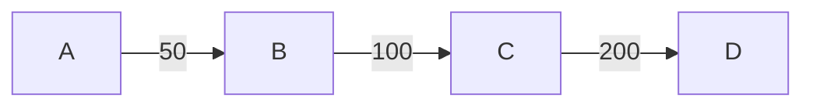

`GEO Protocol / 2018`  `DRAFT`


Fast, safe, double-spending resistant, multi-attendee crypto-protocol  
for atomic and consistent assets transfers.
<br/>
<br/>
[`Dima Chizhevsky`](https://github.com/haysaycheese/) 
[`Mykola Ilashchuk`](https://github.com/MukolaIlashchuk) 
[`Max Demiyan`](https://github.com/MaxDemyan)
[`Denis Vasilov`](https://github.com/Vasilov345)
<br/>
<br/>
<br/>
<br/>
<br/>
<br/>
# Abstract
This specification describes transactions processing algorithm (Algorithm further in the doc) for the [GEO](https://github.com/GEO-Project) network.  
Proposed solution provides ability for up to 1024 network participants [※ 1] to achieve 100% consensus via potentially unstable network, in untrusted environment and under active fraud attempts of malicious participants.

<br/>
※ potentially much more.

# Overview
The objectives of this document are:
1. to provide comprehensive info about proposed method of consensus;
1. to describe guaranteed double spending impossibility, and distributed locks mechanics;
1. to describe the cryptographic primitives used and the provide motivation for including ech of them into the protocol;
1. to describe the method of mathematical and cryptographic confirmation of operations (consensus checking);
1. to prodive mathematical confirmation of the impossibility (or extreme complexity) of the operations compromising;
1. to provide a list of possible edge cases and to describe the ways to avoid/resovle them, as well as possible outcomes of operations.

# Source conditions
This section lists the functional and design requirements for the proposed algorithm — the metrics, that were used to analyze all found and potentially applicable solutions for their applicability in the final protocol.

**1. Requirements for cryptographic primitives:**
  1. _Quantum-resistant cryptography._  
  Algorithm must be avare of usage of cryptographic solutions, which are potentially easily compromised in quantum-based environment (RSA / ECDSA, and other solutions that are based on similar mathematical problems).  
  
  1. _Strict minimum of crypto-primitives._  
  Algorithm must use strict minimum of the crypto systems. The role of each of them must be strictly defined and clearly motivated. 
  
**2. Requirements for operations:**
   1. _Strict 100% consensus._  
   Algorithm must enforce achievement of 100% consensus (with possibility of subsequent verification of it) between all  participants involved: the operation itself must be considered as conducted only if all participants (nodes) has approved it. Otherwise - operation must be cancelled also on all participants devices. Achieved consensus must be mathematically approvable and verifieble by any participant of the operation.
   
  1. _Deferred atomicity._  
  For each one operations launched in the network, all nodes involved in it, must achieve final state, or discard the operation at all. Intermediate states are acceptable only in short period of time, but are unacceptable to be permanent. Achieving atomicity should be:
    1. time-predictable (ideally about a few seconds).
    1. safe towards other operations (launched in parallel).
    1. agnostic towards nodes internal code modifications (hacking) and destructive motivation of the involved participants (fraud attempts).

**3. Requirements for end-point devices (nodes):**
  1. _Applicability for modern smartphones._  
  Algorithm should be usable in environments with limited computing resources and memory. Operations that consume a large amount of resources (for example, operations with significant number of participants), should be easy to process partially (pipelining).
  
  1. _Computational efficiency._  
  Algorithm should have low computational complexity. The mechanism for achieving consensus must avoid frequent calling of complex cryptographic operations (as, for example, Proof Of Work mechanics assumes in some blockchain-based solutions).
  
**4. Requirements for anonymity of operations:**
  1. _Network addressation agnostic_  
  Algorithm must be agnostic on addressation mechanics, so the participants might be present by any kind of addresses (IP / any kind of name resolutions services / prosy services, etc). As a consequence - algorithm should support anonimization via tor and other similar networks.
  
  1. _Lack of a common ledger and common operations history_
  The outcome of the operation must be determined and distributed only within the participants of this operation. The remaining nodes of the network, who do not participate in the operation, must not be able to retrieve the data about operation, and/or its content.
  
**5. Requirements for network resources:**
  1. _Resistance to unstable networks._  
  Algorithm is resistant to network interference, packet loss and/or even whole messages loss. In the worst case, if consensus can't be reached, the operation must be canceled on all devices participating in it.
  
  1. _Transport protocol agnostic._  
  Algorithm must not require a permanent connection and must not base its own mechanics on the guarantees provided by different protocols, starting with the transport layer of the OSI model (for example, TCP). The reference implementation of the algorithm is based on UDP (see network protocol specifications for the details) [※ 1].
  
**6. Requirements for fault tolerance:**
  1. _Strict operation completion guarantee_  
  Algorithm in conjunction with the rest of the GEO protocol ecosystem solutions, must be ablr to ensure the finality of any running operation on the network. Scenarios under which the operation was started, but can not be completed (dead locks) must be striclty documnted and excluded.
  
  1. _Automatic synchronization_  
  Algorithm must be able to automatically resolve possible conflicts between participants of the network, leading them back to the synchronization state, via strit logic of cryptographically-based solutions.
  
  
**7. Requirements for the speed of operations:**
  1. _Sub-second processing time for one participant._  
  This point depends very much on the configuration of the separately taken node, but in general, the GEO Protocol team aims to create an algorithm that is as effective in time as possible. This approach is reflected in a number of optimizations adopted in the algorithm, and continues to find a place in the new solutions.
  
**8. Requirements for portability:**
  1. The algorithm must not contain platform-dependent components.
  1. The algorithm must not be hardware specific or dependent.
  
  
※ To increase the probabilty of achieving consensus, and / or shorten the time of the algorithm execution, various traffic optimisation and correction techniques can be used as well. This protocol does not assumes any of them to be present, but obviously works better in the environments with stable network connections.


# Cryptographic primitives
This section describes the used cryptographic primitives and the motivation for their inclusion in the protocol.

## Lamport Signature
[_Lamport signature_](https://en.wikipedia.org/wiki/Lamport_signature) or _Lamport one-time signature scheme_ is a method for constructing a digital signature. Lamport signatures can be built from any cryptographically secure one-way function; usually a cryptographic hash function is used [※ 1]. In Twin Spark, Lamport's signature is based on [_BLAKE2b_](https://blake2.net/).

### Limitations related to Lamport Signature
Because Lamport signature is a one-time scheme (each one signing procedure discloses part of the private key), `n` key pairs are needed for `n` operations processing. Thus, each one pair of network members, who has common trust line, or channel, must generate a pool of keys, to be able to sign operations, before any other operations would be possible to process. By default, this pool contains `1024` key pairs. Detailed descriptions of the key exchange mechanics and channels establishment can be found in the trust lines specifications `[todo #5: provide link to TL specifications]`.

### Difficulties of applicability in existing solutions
A pair of Lamport keys (Private key and Public key) takes `32 kB`:
* `16 kB` — public key.
* `16 kB` — private key.
* `8 kB` — signature.

The size of signatures and related keys genarated via the Lamport Signature scheme, are a way more expensive than corresponding sizes of signatures and keys, which are based on classic async. cryptograpty solutions (RSA/ECDSA/etc). The relatively large size of signatures makes the Lamport crypto system a very unlikely candidate for the inclusion in existing blockchain solutions in the foreseeable future due to a significant increase in the ledgers growth rate. Also, Lamport's signature, has no practical sense in systems whose cryptographic strength directly depends on components built on classical approaches and are known to be vulnerable against quantum-based attacks. For example, the inclusion of the Lamport cryptosystem in solutions built on top of ethereum / bitcoin, or other popular blockchain solution, has no practical meaning due to the underlying potential vulnerability of the central ledgers of these systems.

※ For each hash function that generates an n-bit digest, the ideal resiliency to restore the prototype and to restore the second prototype implies 2n operations and 2n bits of memory for each one execution of the hash function in the classical computational model. Using the Grover algorithm, restoring the pre-image of the ideal hash value is bounded from above by `O (2n / 2)` operations in the quantum computational model. At the moment, Lamport's signature is considered one of the most reliable digital signature algorithms, proved to be resistant to attacks using quantum computing.


### Motivation for inclusion in the protocol
Using of the Lamport signature significantly improves the cryptographic strength of the proposed solution in the [face of potentiall attacks using quantum computations](https://csrc.nist.gov/Projects/Post-Quantum-Cryptography). This kind of advantage is very important in the conditions of active development of computer technologies and constant increasing of the probability of the threat of classical cryptographic-systems with a public key. 


## BLAKE2b
[BLAKE2](https://blake2.net/) is a cryptographic hash function faster than MD5, SHA-1, SHA-2, and SHA-3, yet is at least as secure as the latest standard SHA-3. BLAKE2 has been adopted by many projects due to its high speed, security, and simplicity. 

### Motivation for inclusion in the protocol
Along with other finalists of the NIST SHA-3 contest, it has proven and reliable cryptographic stability, but it is much faster than SHA-3 (keccak). Unlike keccak, blake2 is built on to of classical approaches for hash-functions, so its internal structure is more studied for various kinds of vulnerabilities.


# Protocol decription
## Requirements
* **[R1]** Transaction time window — `1-15` seconds for non-fraud operations, and up to `~10 minutes` for processing problematic operations. It is expected, that more than 90% of all operations in the network would be non-fraud. This assumption is only related to the estimated network throughput.

* **[R2]** Each transaction must collect `100% consensus` of all participants, involved into the operation, to be considered as done, or rejected. Reject of even one of participants must lead to whole transaction rejecting.

* **[R3]** Transactions must be able to involve up to several hundreds of participants at the same time.

* **[R4]** Transactions must be able to use up to several hundreds of different payment paths. `todo: add link to the Routing specification`

* **[R5]** Transactions must be able to proceed without any internal token. Participants must not be enforced to charge any commissions for the middle ware operations processing.

# Source assumptions

* **[SA1]** Due to proposed [network topology, based on trust lines]() `[#todo: add link to proposed network design]`, double spending is impossible, by design. Please, see [trust lines specifications]() `[#todo: add link to TL architecture]` for the details.

# Abstract
*At this point, it is assumed that reader is familiar with basic [Trust Lines]() `[#todo: add link to TL architecture]` mechanics and [economic model]() `todo: link`. This section only provides explanation for the payment mechanics itself, without any base-level ideas explanation.*

Let's assume, there is a network with 4 attendees `{(A), (B), (C), (D)}` involved into the next topology:




* *(A) trusts (B) 50 (of some equivalent);*
* *(B) trusts (C) 100 (of some equivalent);*
* *(C) trusts (D) 200 (of some equivalent);*

The initial task looks simple:
* provide ability for `(D)` to pay `(A)` 50  of some equivalent through nodes `{(C), (B)}`;
* provide strong guaranties for `(A)` and `(D)` about transaction's state, for example that it was approved/rejected, and would not change it's state any more, so `(A)` would be able to react on it (for example, ship some goods to `(D)`).
For `{(B), (C)}` it is important, that transaction would not be partially committed (committed on some trust lines, and doesn't committed on the rest).

The challenge itself is to provide information about **final** state of the transaction to all the participant in *secure Byzantine-resistant manner, and in predictable time window*.

`todo: add CAP Theorem analyzing`

`todo: add description for the scenarios with several concurrent paths used`


# Stage 1: Amount reservation
Node, that initiates the transaction, takes part in it as `Coordinator`,
(node `(D)` in example scheme) — special node, that cares most of computational load of the operation, and coordinates all other nodes during whole life cycle of the transaction.

* **Note:** `Coordinator` uses significantly more network traffic, in comparison with other nodes, involved into the operation, but it has economic motivation to do so — it wants to transfer assets to some node.

1. `Coordinator`, in cooperation with `Receiver` (node `A` in the example scheme), discovers all possible network paths `{Coordinator -> Receiver}`. In case if no paths are available — algorithm execution stops with error code `No routes`.
Please, see [Routing]() `[#todo: link]` for the details on paths discovering.

1. `Coordinator` attempts to reserve required `transaction amount` to the `Receiver` on several (or all, if needed) discovered paths. For each path, `Coordinator` sequentially sends requests for amount reservation to all intermediate nodes on this path. Each request contains required reservation amount and address of the node, to which the reservation should be created.
    * `Coordinator (D)` knows whole path `{(D), (C), (B), (A)}` (`todo: describe also scenarios with several concurrent paths`), but it doesn't knows and can't predict `max. common amount` between all nodes on this path (due to the network volatility `todo: describe network volatility`), so it sends requests to the nodes in sequential manner.
    * `todo: Analise if coord. can send requests to all nodes in parallel`
    * `todo: Analise if coord. can recommend timeout for middle ware nodes`
    * Each middle-ware node `{(C), (B)}` and `Receiver (A)`, on reservation request received, does one of 3 things possible:
        1. Accepts reservation fully, **if there is enough free amount on requested trust line**. In this case, node
            1. Creates local reserve on the trust line with specified neighbour for the specified amount.
            1. Sets timeout for the created reservation to ? seconds `todo: replace ? with real world seconds parameter from the source`. Created timeout avoids eternal reservation and is used for canceling the operation, in case of occurred unpredictability.
            1. Sends `approve` to the `Coordinator` with amount reserved;
        1. Accepts reservation partially, **if there is some free amount on requested trust line is present, but it is less, than required.** In this case node
            1. Creates local reserve on the trust line with specified neighbour for the **available** amount.
            1. Similarly, to the previous case, sets timeout for the created reservation to ? seconds `todo: replace ? with real world seconds parameter from the source`.
            1. Reports `approve` to the `Coordinator`, but with less amount reserved, than was requested;
        1. Reports `reject` to the `Coordinator` in case if
            1. no [more/any] reservation is possible;
            1. node received reservation request towards some other node, that is not listed as it's neighbour;
            1. node received reservation request that contains info about reservations, that was not done by this node;
        * **Note:** it is possible, that some node would be several times requested by the `Coordinator`, to create several different reservations towards several different neighbours. This case is probable, when some middle ware node is present on several concurrent payment paths at the same time. `todo: add diagram`.
    * **Note:** Created reserves are only temporary locks on the trust lines, and must not be considered as committed changes (debts). This locks are important mechanism for preventing usage of greater trust amount, that was initially granted, so it is expected that each one node would very carefully accounts this reservations.
    * **WARN:** Trust lines reservations and related transactions must be implemented in ACID manner. Transactions and related trust lines locks must be restored after each one unexpected node failure and/or exit.
    * **WARN:** Each one payment transaction, that was restored after node failure, must be automatically continued from `Stage Z: Recover`.

    ```mermaid
    sequenceDiagram
        Coordinator (D)->>C: Reserve 200
        C->>B: Reserve 200
        B->>C: OK, only 100 reserved
        C->>Coordinator (D): OK, only 100 reserved

        Coordinator (D)->>B: Reserve 100
        B->> Receiver (A): Reserve 100
        Receiver (A)->>B: OK, only 50 reserved
        B->>Coordinator (D): OK, only 50 reserved

        Coordinator (D)->>Receiver (A): Reserve 50
        Receiver (A)->>Coordinator (D): OK, only 50 reserved
    ```
    
    
    ```c++
    struct RequestAmountReservation {
        TransactionID transactionID;
        Amount amount;
        Address neighbourAddress;
    }
    ```
    `todo: link source`

    ```c++
    struct ResponseAmountReservation {
        TransactionID transactionID;
        Amount amount;
    }
    ```
    `todo: link source`

1. During paths processing, `Coordinator` handles so called `paths map` — internal data structure with information about all nodes, all neighbours (first level nodes), and all reservations created on all used payment paths.
During amount reservation, it is very probable, that amount reservations, that was created earlier on this path, would be greater, than amount reservations, that was created later (for example, amount reservations on `Coordinator's` neighbours (first level nodes) probably would be greater, than reserved amount on the `Receiver's` neighbours). But it is important to shortage all created reservations, on all used trust lines of the paths to the **common amount**. That's why `Coordinator` remembers amounts of all reservations of all used trust lines, so it is able to inform any node of this path, about necessity to shortage its reservation(s).
    * **Note:** it is expected, that middleware nodes `{(C), (D)}` and `Receiver` would have economic motivation to update their reservation amounts as quickly, as possible, because each one reservation created freezes some part of nodes liquidity.  `todo: add mermaid diagram`

1. During processing of long paths, or significant amount of paths in total — there is a non-zero probability, that one, or several middle-ware nodes `{(B), (C)}` and `Receiver (A)` (one, or several times) would ask `Coordinator (D)` for the transaction state:

    **Case 1: Transaction is still in progress:**
    ```mermaid
    sequenceDiagram
        B->>Coordinator (D): Is TA (ID) still alive?
        C->>Coordinator (D): Is TA (ID) still alive?
        Receiver (A)->>Coordinator (D): Is TA (ID) still alive?
       
        Coordinator (D)->>B: Yes, wait some more
        Coordinator (D)->>C: Yes, wait some more
        Coordinator (D)->>Receiver (A): Yes, wait some more
    ```
    

    ```c++
    struct RequestTransactionState {
      TransactionID transactionID;
    }
    ```
    `todo: link source`

    ```c++
    struct ResponseTransactionState {
      TransactionID transactionID;
      byte state; // [0 — Wait; 1..255 — Reject]
    }
    ```
    `todo: link source`
    * In case if `Coordinator (D)` responds with "Yes, TA is still in progress" - it is recommended for the node to keep processing it. In this case node simply reinitialize it's internal timeout and keeps waiting. This stage might be repeated several more times. **It is important for middle-ware nodes to wait as long as `Coordinator (D)` asks to, otherwise - whole transaction would be dropped.** `todo: implement paths re-collecting`.
    * **WARN:** There is an ability for the `Coordinator` to hang reservation for a long time and decrease nodes liquidity. To avoid this - node must keep counting of prolongations done. In case if next one prolongation begins to be not comfortable for the node (for example, `Coordinator` responds too long) — it might simply reject the transaction `[Stage B]` Max amount of prolongations should be decided by each one node for itself, based on it's internal trust to the coordinator.

    **Case 2: Transaction has not collected required amount:**
    ```mermaid
    sequenceDiagram
        B->>Coordinator (D): Is TA (ID) still alive?
        C->>Coordinator (D): Is TA (ID) still alive?
        Receiver (A)->>Coordinator (D): Is TA (ID) still alive?
       
        Coordinator (D)->>B: No, abort it!
        Coordinator (D)->>C: No, abort it!
        Coordinator (D)->>Receiver (A): No, abort it!
    ```
    
    * In case if `Coordinator` responds with `abort` (for example, because required amount could not be collected on discovered paths) — transaction must be simply rejected `[Stage B]`. Amounts reservations might be safely dropped as well.
    * **Warn:** all other requests, related to this operation (for example, from other nodes) must be dropped, so each one node must remember this transaction for some period of time, and reject all requests, related to it. `todo: specify memory timeout from source`.
   
    **Case 3: No coordinator response:**
    ```mermaid
    sequenceDiagram
        B->>Coordinator (D): Is TA still alive?
        C->>Coordinator (D): Is TA still alive?
        Receiver (A)->>Coordinator (D): Is TA (ID) still alive?
       
        Coordinator (D)-->>B: (?)
        Coordinator (D)-->>C: (?)
        Coordinator (D)-->>Receiver (A): (?)
    ```
    
    * In case if no response was received from the `Coordinator` — one of 3 things might take place:
        1. `Coordinator` goes offline unexpectedly and/or is unable to proceed.
        1. Network segmentation takes place and no network packets are delivered / received to / from the node / `Coordinator`.
        1. `Coordinator` behaves destructively and doesn't responds to the nodes requests.
        In all cases, it is safe for the middle-ware node to drop the transaction and related amounts reserves `[Stage B]`.
    * **Warn:** all other requests related to this operation (for example, from other nodes) must be dropped, so each one node must remember this transaction for some period of time, and reject all requests, related to it. `todo: specify timeout`.

1. On response from middle ware node, or `Receiver` - `Coordinator (D)` checks the response:
    * In case of `approve` - `Coordinator (D)`:
        1. Updates it's internal `paths map`;
        1. (re)calculates (probably shortates) max common available amount;
        1. In case if node, that sent `approve` to the `Coordinator` is last node in its path - then `Coordinator` current reservations configuration (list of neighbours nodes and amount reservations towards them) to all nodes, on this path, including `Receiver`. This info is important, because there is a non-zero probability of the case, when some path from a collection of discovered paths, would be dropped during amount reservation (for example, because some trust line on it has no enough amount). In this case, it is very probable, that some amount reservations towards some nodes would not be needed any more, but the others would stay necessary. It is even possible, that this configuration changes would take place on the same node. That's why `Coordinator` reports whole new amounts configuration state to all middle ware nodes.
    * In case of `reject` - `Coordinator (D)` drops this path at all from payment, and starts collecting amount on one of other available paths. During path dropping - it also informs all the nodes, that are involved into it about dropped reservations, via sending  current reservations configuration to them.
    * **Note:** in case if all paths are processed, but no required amount was collected - `Coordinator` suspends current operation and re-tries to collect more paths from the network. `[todo: describe paths complementing process]`.
1. In case if `collected amount == needed amount` — stage 1 is considered as complete.

# Stage 1.1: Debts receipts exchange
1. From middle-ware nodes perspective, processing of the amount reservation requests could be schematically explained in the next way:
   
    ```mermaid
      sequenceDiagram
          Coordinator (D)->>C: Reserve 200
          C->>B: Reserve 200
          B->>C: OK, reserved 100 (without sign yet)
          C->>Coordinator (D): OK, only 100 reserved
    ```
    

1. Node `(C)` reserves required amount on its side first. In case of success - it suspects for successful reservation on the neighbour node (`(B)` in the example), and sends the appropriate request to it. In case of received confirmation response from the neighbour node - `(C)` reports success to the `Coordinator`.
1. Coordinator then updates it's internal `paths map`, calculates updated trust lines configuration for each one node involved into the path, and sends it to the nodes, via transferring them (trust lines configurations) through the neighbour nodes. `todo: think about optimization for this logic` `todo: possible vulnerability: intermediate node might fake the original TL configuration. This would be discovered on the next stage, but currently it leads to possibility to dos the network and hang transactions and reserves for some time`. For example, final configuration for the `Receiver` would be sent by the coordinator via node `(B)`, final configuration for the node `(B)` - would be sent via the node `(C)` and so one.

# Stage 2: Trust context establishing
1. After `Stage 1`, `Coordinator` sends final trust lines configuration to all nodes, involved into the operation. On final configuration receiving, each one node goes through the next steps:
    1. Checks received final configuration.
    * If there are any trust lines, reserved amount of which must be shortened - then node shortates them.
    * If there are any trust lines, amount of which must be increased — then transaction must be rejected, because it is a malicious operation (reservations increasing).
    * In case if some reservations, that are present on the node, are absent in the reservations list — then this reservations must be also dropped on the nodes side.
    * In case if some reservations from the request are not present on the node - then the operation must be rejected, because this is a malicious operation (reservations increasing).
    1. Fetches signed debt receipts from all nodes, that would increase their debt after the operation would be performed.
        ```c++
        struct TrustLineReceipt {
        TransactionID transactionID;
        
        // Amount of reservation for the operation.
        Amount amount; 
    
        // Index of Public Key, that would be used by the node for signing current TA.
        // Please, see Trust Lines specification for the details
        // about Public Keys pool.
        byte[2] transactionPubKeyIndex;

        // Crytographic sign of the receipt,
        // generated by the Public Key with positional number ==
        // (transactionPubKeyIndex - 1).
        // Please, see scheme further for the details.
        Sign sign;
        }
        ```
        ```
                                |-------|--------------------------|
                                | Index | Public Key (8192 B)      |
                                |-------|--------------------------|
                                |   1   | 0xe7e69d34066f..975bc414 |
                                |-------|--------------------------|
                                |   2   | 0x3155aa7feea3..8ac41c43 |
                                |-------|--------------------------|
                                |  ...  |            ...           |
                                |-------|--------------------------|
            TAPubKeyIndex -->>  |   n   | 0x672a8b938a3e..af1045c3 |  <<-- TA Public Key
                                |-------|--------------------------|
                                |  n+1  | 0xe97df69316f3..3a75d3f8 |  <<-- Receipt Public Key
                                |-------|--------------------------|
                                |  ...  |            ...           |
                                |-------|--------------------------|
                                |  1024 | 0xbb63989a1643..5c5edbf6 |
                                |-------|--------------------------|
        ```
    1. Checks received TrustLineReceipt for sign validity and in case if not - rejects the operation `[Stage B]` 

1. Each one midleware node `{(A), (B)}` and `Receiver`, after signed receipts receiving and checking — sends to the `Coordinator`
     * its Public Key which this particular node would use for signing the  transaction;
     * up to 64 addresses of `delegates`, trusted by this node.
        * **Note:** Node might not delegate any `delegates` for the operation, in case if it trusts **to all** participants of this operation.  Please, see `Delegate` detailed description, for the details about consequences of such decision.

    ```mermaid
    sequenceDiagram
        B->>Coordinator (D): [PubK + delegates list, ~9kB]
        C->>Coordinator (D): [PubK + delegates list, ~9kB]
        Receiver (A)->>Coordinator (D): [PubK + delegates list, ~9kB]
    ```
    

    `todo: request structure`

1. `Coordinator` collects Public Keys and Delegates lists from all participants.
    * In case if not all expected records was collected — `Coordinator` rejects the operation `[Stage: A]`;
    * In case if all expected records was collected — `Coordinator`:
        1. finds common `delegate` for the transaction. To do it, `Coordinator` joins received delegates lists from other participants with its own list of proposed delegates. Intersects generated list and finds common one, or several common delegates.
            * In case if no common delegate if found, but one, or more nodes, including the `Coordinator` itself, has been delegated non-empty delegates lists — then `Coordinator` rejects operation with code `Out Of Common Trust` even without signing it `[Stage: A]`.
            * In case if there are several common delegates present after the intersection — `Coordinator` is able to choose one it prefers more.
            * **Note:** `Coordinator`, similarly to other nodes, might not delegate any `delegates` for the operation. Please, see `Delegate` detailed description, for the details about consequences of such decision.
        1. fetches Pub Key of selected `delegate` and attaches it to the list of other nodes Pub Keys. In case if no Pub Key was received from the `delegate`, and there is no other common candidate(s) for the delegating — then `Coordinator` rejects the operation with code `Inoperable Delegate` even without signing it `[Stage: A]`.
        1. creates `votes list` and includes selected delegate address into it; `todo: describe format of the vote list`
        1. includes received Pub Keys into it alongside with its own Pub Key;
        1. sorts generated `votes list` by the participants Pub Keys in ascending order.
        Sorting must be done byte-by-byte. In case if 2 (or more) equal Pub Keys are present — transaction must be rejected with code `Duplicated Pub Keys` `[Stage: A]`.
        1. does all the checks from `Stage 4: Voting`. In case of **positive decision** — goes forward and signs generated `votes list` by its Sign [`Stage: 4.1`].
        In case of **negative decision** - `Coordinator` rejects operation with relevant code even without signing it `[Stage: A]`.
        1. Sends signed `votes list` to all other nodes.
        1. Begins waiting for nodes votes for the operation. `todo: if no votes are received - go to the delegate`.

    ```mermaid
    sequenceDiagram
        Coordinator (D)->>B: Votes List
        Coordinator (D)->>C: Votes List
        Coordinator (D)->>Receiver (A): Votes List
    ```
    

    ```c++
    struct VotesList {
        TransactionID transactionID;

        // Total participants count, including the Coordinator.
        byte[2] participantsCount; // 65534 at max

        Address coordinatorAddress;
        PubKey coordinatorPubKey;

        Address participant1Address;
        PubKey participant1PubKey;

        // ...
        // Other participants data goes here
        // ...

        Address participantNAddress;
        PubKey participantNPubKey;

        Sign coordinatorSign;
    }
    ```
    `todo: is custom sorting order stil needed here?`


# Stage 3: Trust context checking

`todo: swap this stage with voting. It is much more efficient for nodes to vote after pub keys digests checking. `

1. On `votes list` received, each one middle ware node `{(B), (C)}` and `Receiver`:
    1. Checks that received message contains declared count of participants records (PubKeys and addresses). In case if this check fails — node must reject transaction, `[Stage B]`.
    1. Calculates `keccak512(PubKey)` for each `PubKey` from the received `votes list`.
    Node also includes its own public key into the calculation process.
    As a result, node creates the map `Node(PubKey) -> Keccak512Digest`.
    For example, for node `(B)` this map might be as follows:
    ```
        Node A { <Address> }    ->  f7d6...9ecb;
        Node B                  ->  64f4...3737;
        Node C { <Address> }    ->  e697...90da;
        Node D { <Address> }    ->  eff1...06ac;
    ```

    1. For each generated digest, additional approve from the remote node is required. Each one node must ask each one another node about validity of it's public key, by sending it's digest for the verification. This step is necessary to prevent signs spoofing.

    ```mermaid
    sequenceDiagram
        B->>Coordinator (D): Request PubKey Digest
        B->>Receiver (A): Request PubKey Digest
        B->>C: Request PubKey Digest

        Coordinator (D)->>B: PubKey Digest
        Receiver (A)->>B: PubKey Digest
        C->>B: PubKey Digest
    ```
    

    ```c++
    struct RequestPubKeyDigest {
        TransactionID transactionID;
    }
    ```

    ```c++
    struct ResponsePubKeyDigest {
        TransactionID transactionID;
        byte[64] digest;    // keccak512 digest.
    }
    ```
    1. If all collected digests of pub keys are equal to the corresponding digests, generated on the node — then it is assumed, that `Coordinator` collected original public keys, no keys substitution was done, and the `votes list` has been created correct. Otherwise — node must vote for the rejecting of this operation `Stage 4.B`.

# Stage 4: Voting
1. Each middleware node `{(B), (C)}` and `Receiver` does the next checks:
    1. All trust lines, included into the final configuration, are approved by corresponding neighbor nodes. Corresponding receipts are also present/sent, are signed correctly, and are permanently stored.
    1. All particpants from the final configuration are present in votes list.
    1. There are no duplicated node addresses or Pub Key are present in `votes list`.
    1. Digest of **all** nodes from the votes list are checked and all of them are correct.
    1. All internal timeouts has been not fired up. `todo: is it really needed here?`
    1. Participants of the votes list are sorted in ascending order. It is necessary for signing stage.
1. If one of this conditions is not met — node must not sign the operation, and forget it. Otherwise, **if all conditions are met —** node should **sign the operation**.

# Stage 4.A: Signing
* Operation is considered as performed well only if 100% of participants has voted for the operation approve.
* Operation is considered as approved by the node, only if vote list, generated by the `Coordinator` contains valid node sign.
* It is assumed that votes list is sorted. See section 2 for the details.

The algorithm for the sign generation is the next:

1. Concatenate all participants Pub Keys from votes list into one bytes sequence.
1. Concatenate transaction ID to the result bytes sequence.
1. Concatenate `Approve Sequence` to the result bytes sequence.
1. Sign generated sequence by the nodes Sign. `todo: link for signing using Lamport One Time Sign`.

### Approve sequence
There is a special bytes sequence, that must be concatenated to the votes list:
* it is generated with sustainability for fingerprinting and differential analise in mind, so it is relatively long to stay sustainable even in case if there are only 2 Public Keys present in `votes list` (direct payment performed).
* in case if all Public Keys would be weak for the differential analise — it is expected, that this sequence in cooperation with keccak512 will play sufficient role for the good output data randomness.

`todo: link to approve sequence (refined S Blocks, 16kb of data)`

`todo: think about injecting vs concatenating`

`todo: describe why rejecting by the node leads to TA states collision`.

## Stage 4.B: Consensus processing
1. Node sends signed `votes list` back to the `Coordinator`.
1. Node starts waiting for the response from the `Coordinator` with other nodes signs. See `Stage 5` for the details. Recommended timeout for this operation is `n*2` seconds, where `n=votes list participants count`.
1. There are 2 further cases possible:
    1. `votes list` signs by other participants arrived to the node before timeout has been fired up, it is correct and contains all 100% participants approve-signs.
        1. In this case operations is considered done, node stores received `votes list` with all the signs into its internal storage and links it to previously collected debts receipts from it's neighbours.
        1. [optional] Node might preemptively send its collected 100% `votes list` to the delegate, and wait for approve from it, to be sure, that no operation canceling is possible now. Otherwise, if this is impossible (for example, during of network segmentation on the nodes side) — it is strongly recommended for the node to wait up to 15 minutes before final commit. This timeout must be enough for the `Delegate` to form final decision on the transaction, in case is some other node requested arbitration.
        1. The last step — committing the operation. Now node has all needed proof, to require debt refunding from it's neighbours (if any). Debts revise might be initialized towards each one neighbours, whose balance was changed. `todo: describe neighbour revise procedure`. At this point algorithm is considered as finished.
    1. `votes list` doesn't arrived during expected timeout. In this case node is going to require delegates arbitration `[Stage 5]`.

# Stage 5: Consensus collecting by the Coordinator
1. `Coordinator` waits for the signed votes lists from the nodes involved into the operation. On each one votes list arriving - `Coordinator` merges received votes list into common one, by concatenating received nodes signs into common votes list. In case if signs of all nodes was received well — the transaction is considered as approved. `Coordinator` in this case stores the final `votes list` into it's trust lines registry `todo: provide link to the trust lines logic`, and propagates it to all nodes in the transaction. After this step — algorithm is considered as done, and transaction is considered as finished.
1. In case if votes arrived partially - `Coordinator` asks delegate node for the arbitration.

# Stage 6: Delegated arbitration.
Delegate arbitration is used in case when there is an uncertainty about the operation processing, but some (or several) node(s) has been signed it already and sent their signs into the network. In this case, this node(s) has no ability to change it's vote(s), because:
    * nodes can't perform any reject, otherwise - it would be amboguous. In case if operation was positively signed, there is no way to revert it.
    * propagating of negative sign would lead into the further consensus complexity, but in long term perspective is ineffective because of `Forced Consensus Propagation`.

For the timely limited consensus generation, `delegates` are used — special class of trusted nodes, that are selected by common decision of all nodes, involved into the operation (`Stage 2`), and are responsible for decision generation in case of occurred uncertainty.

The role of a delegate node is simple: it doesn't takes part into the operation until some node asks the delegate to join. It is expected, that in most cases, operations would perform well even without any delegates involved, but, for cases when some node, that takes part into the operation, experiencing lack of consensus — special decision generating flow is envisaged.

1. After the initial request received — delegate starts polling of the participants of the operation for their `votes lists`. If some node has `votes list` already signed by all other participants — it should be reported to the `Delegate`. Otherwise - node simply reports its decision on the operation, by sending its own `votes list` with its sign only to the `Delegate`.  
    * **Note:** Delegate continues to poll participants in case if some of them are not responding. It is recommended to use 10 seconds timeout between polling rounds.
    * **WARN:** In case if node was queried by delegate for the `votes-list`, and after that has been received complete `votes-list` from the other participant - than this node must pontificate the `Delegate` about received votes list, and not proceed until there would be final decision from the `Delegate`.
1. From received `votes list` `Delegate` tries to collect one with signs of all participants of the operation. It is the same logic, as coordinator does on receiving `votes lists` from the participants.
    * In case if delegate collects 100% consensus during processing of `votes lists` of participants — then it immediately shares this `votes list` to all participants by the `[Votes list pushing]` mechanics. At this point of time — it is expected, that all participants are able to rich final state of the operation — **committing**.
    * In case if delegate has been unable to reach appropriate decision based on received `votes lists` during ~10 minutes (`todo: describe delegates decisions flow`) from the initial request — then it is able to reject the operation and share it as a final decision to the nodes.
    * **Warn:** please, note, that delegate might only force operation reject, and can't force its commit. This is important security restriction. `todo: describe why`

# Votes list pushing (delegated logic)
There is a very small, but still non-zero probability of a case, when 100% positive consensus `votes list` would appear somewhere in the network, and would not be available to the `Delegate`. As a result, `Delegate` would force operation reject and because of highest priority possible, this decision would be accepted by the nodes, even if operation is already committed on them. That leads to the operation cancellation, and to avoid some fraud attempts — this decision should be delivered to the nodes as fast as possible.

To do so, delegate will notify each of them once in a 3-5 seconds, during first 20 minutes. After that, if no notification acquiring received from the node - during next week, final decision should be propagated with exponential timeout, starting from 10 seconds up to 10 minutes between sending attempts. After that period of time delegate stops notifications attempts for participants, that are unreachable.

All decisions made by the `Delegate`:
* must be archived;
* must be available publicly. It is safe for the participants privacy to share this information, because votes list only contains final decision on the operation, but no any additional context is present in it. It even has not operation amount included, because it is unnecessary here. `todo: link to votes list structure explanation`.

# Forced consensus propagation
In cases, when some pair of nodes, that are using common trust line, has different balances on it (for example, as a result of partial data lost by some node, or data manipulation) — there is a special mechanism is envisaged — Trust Line Revise — protocol, that is based on top of collected `votes lists` and provides strong decisions for each one controversial situations possible. `todo: add link to the TL Revise`. As a result of this operation — 100% consensus might be achieved by both nodes in 100% cases.

Being applied to several neighbours, this mechanism has cascade influence and as a result — forces fair balances propagation through the network even in case of fraud manipulation with trust lines data on nodes sides.

`todo: describe it detailed`

# Stage A: Coordinator's behaviour after transaction reject
1. On TA reject `Coordinator` instantly forgets about the operation.
1. [optional] `Coordinator` notifies operations participants about the operation canceling.
1. For all requests about operation state `Coordinator` simply responds that it knows nothing about that operation, and it is enough for the other nodes to drop their pending reservations too.

# Stage B: Middle wares node behaviour after transaction reject

1. On TA reject node instantly forgets about the operation and drops all related reservations.

# Stage Z: Recover:
During operation processing, there is non zero-probability, that some node involved (or all of them) would enter inoperable state in some reason (unexpected power off, network segmentation, etc). In this case, when operability of the node would be restored, such node(s) must proceed each one transaction that was initialized, but has no final decision yet.
* For the protocol simplicity reasons, nodes that enter "recover" state and has not signed the operation, must not vote for transaction approving any more. Only "reject" is allowed.
* For the signed operation — node must check for the final decision about the operation from its neighbour(s) involved and the `Coordinator`. In case if no response from any one of them in time of 10 minutes — `Delegate` arbitration must be requested `[Stage 5]`.

# Data types used
This section provides explanation of used data structures in developers friendly format.

```c++
// It is expected that TAID
// would be randomly generated 24 bytes long sequence.
using TransactionID = byte[24];

// todo: link to the crypto description.
using PubKey = byte[8192];
using Sign = byte[8192];

// todo: move this into the addressation doc.
struct Address {
    byte typeID;
    byte length;
    byte[1..256] data;
}

// "Amount" specifies transaction amount or trust line amount where it is needed.
// Length field makes it possible, to transfer only significant bytes
// through the network, and to ignore zeroed part of the amount.
struct Amount {
    byte lenth;
    byte[1..32] value;
}

```

# Operation result codes

|Code|Mnemonic|Description|
|----|--------|-----------|
|0   |OK| |
|... |...|...|
|252 |Duplicated Addresses| `todo`|
|253 |Duplicated Pub Keys| `todo`|
|254 |Out Of Common Trust| `todo`|
|255 |Inoperable Delegate| `todo`|
--------------------

# Index

### Node
Instance that runs GEO Network protocol, and has established [trust line(s)]() with other node(s). Nodes are responsible for transactions processing.

### Delegate
Node, that can take part into the transaction, but for the coordination purposes only. In case of abnormal transaction flow, it might provide final decision about the operation for other nodes. It is also responsible for transaction final state spreading, in case if final transaction state was generated by the delegate. Transaction can contain only one delegate at a time.

Delegate nodes knows about:

* List of nodes, that are involved into the operation;
* Which nodes approved / rejected the operation.

Delegate nodes knows nothing about:

* Payment destination and the transaction amount;
* Nodes balances;

Delegate node is unable to see all operations in the network, but only those, which was processed by the delegate itself.

### Coordinator
Special node, that cares most of computational load of the operation, and coordinates all other nodes during whole life cycle of the transaction.

### Receiver
Node, that takes part into the operation as a transfer destination node.


# Contribution
#### How to join discussion?
* Please, follow commits history for details about changes.
* Please, use commits comments to propose changes.

#### Technical requirements
* This specification uses mermaid charts, so, please, ensure your environment supports them for correct document render.

# Credentials
`todo: list ideators`

# License
[]()

**[MIT License](https://opensource.org/licenses/MIT)** (GEO Protocol worldwide team, 2018)


Permission is hereby granted, free of charge, to any person obtaining a copy of this software and associated documentation files (the "Software"), to deal in the Software without restriction, including without limitation the rights to use, copy, modify, merge, publish, distribute, sublicense, and/or sell copies of the Software, and to permit persons to whom the Software is furnished to do so, subject to the following conditions:

The above copyright notice and this permission notice shall be included in all copies or substantial portions of the Software.

THE SOFTWARE IS PROVIDED "AS IS", WITHOUT WARRANTY OF ANY KIND, EXPRESS OR IMPLIED, INCLUDING BUT NOT LIMITED TO THE WARRANTIES OF MERCHANTABILITY, FITNESS FOR A PARTICULAR PURPOSE AND NONINFRINGEMENT. IN NO EVENT SHALL THE AUTHORS OR COPYRIGHT HOLDERS BE LIABLE FOR ANY CLAIM, DAMAGES OR OTHER LIABILITY, WHETHER IN AN ACTION OF CONTRACT, TORT OR OTHERWISE, ARISING FROM, OUT OF OR IN CONNECTION WITH THE SOFTWARE OR THE USE OR OTHER DEALINGS IN THE SOFTWARE.

