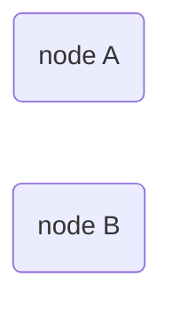
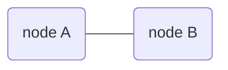
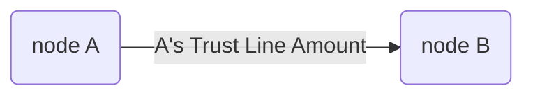
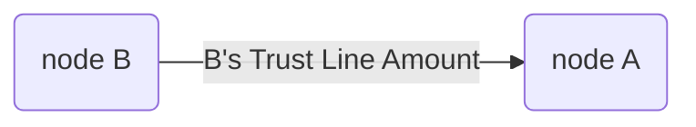

Quantum-resistant crypto-protocol for consistent state sharing.  
`GEO Protocol / 2018` `Draft`
<br/>
<br/>
<br/>
[`Dima Chizhevsky`](https://github.com/haysaycheese/) 
[`Mykola Ilashchuk`](https://github.com/MukolaIlashchuk) 
[`Max Demiyan`](https://github.com/MaxDemyan) 
<br/>
<br/>
<br/>
<br/>
<br/>

# Abstract
This specification describes algorithm _("Algorithm"_ further in the doc.) for the [GEO Network](https://github.com/GEO-Project). Proposed solution provides ability for 2 participants to share common state of a trust line / channel and syncronise it with quantum resistant proof of operations performed.

<br/>
<br/>
<br/>
<br/>

# Overview
The objectives of this document are:
1. to provide comprehensive info about proposed method of consensus between 2 participants about balance on the trust line between them;
1. to prodive mathematical confirmation of the impossibility (or extreme complexity) of the operations compromising [#todo: add math proof];
1. to provide a list of possible edge cases and to describe the ways to avoid/resovle them, as well as possible outcomes of operations.

<br/>
<br/>

# Source Conditions and Requirements
This section lists the functional and design requirements for the _Algorithm_.

**1. Requirements for cryptographic primitives:**
1. _Quantum-resistant cryptography._  
  _Algorithm_ **must** be avare of usage of cryptographic solutions, which are potentially [easily compromised in quantum-based environment](https://csrc.nist.gov/Projects/Post-Quantum-Cryptography) (RSA / ECDSA, and other solutions that are based on similar mathematical problems);  

1. _Strict minimum of crypto-primitives._  
  _Algorithm_ **must** use strict minimum of the crypto systems. The role of each of them must be strictly defined and clearly motivated;  

1. _Compatibility with [transactions processing algorithm](https://github.com/GEO-Protocol/specs-protocol/blob/master/transactions/transactions.md)._ 

**2. Requirements for end-point devices (nodes):**
1. _Applicability for modern smartphones._  
  _Algorithm_ **must** be usable in environments with limited computing resources and memory. Operations data on a stable storage **must** fit into less than `200 Mb` per trust line;  
  
1. _Computational efficiency._  
  _Algorithm_ **must** have low computational complexity. The mechanism for achieving consensus on a trust line's state **must** avoid frequent calling of complex cryptographic operations (as, for example, Proof Of Work mechanics assumes in some blockchain-based solutions).  


**3. Requirements for network resources:**
1. _Resistance to unstable networks._  
  _Algorithm_ **must** be resistant to network interference, packets loss and/or even whole messages loss;  
  
1. _Transport protocol agnostic._  
  _Algorithm_ **must not** require a permanent connection and must not be base its own mechanics on the guarantees provided by different protocols, starting with the transport layer of the OSI model (for example, TCP).


**4. Requirements for data transfers security:**
1. _Resistance for traffic sniffing_
  _Algorithm_ **must** encrypt data that passes between the nodes in end2end manner. 


**5. Requirements for fault tolerance:**
1. _Algorithm_ **must** perform operations even in cases when network connection is absent and automatically sync trust lines states on connection restore.


**6. Requirements for portability:**
1. _Algorithm_ **must not** contain platform-dependent components.
1. _Algorithm_ **must not** be hardware-dependent.

</br>
</br>

# Cryptographic Primitives
This _Algorithm_ is based on [Lamport One Time Signature Scheme](https://en.wikipedia.org/wiki/Lamport_signature), [BLAKE2b hash function](https://blake2.net) and [AES256](https://en.wikipedia.org/wiki/Advanced_Encryption_Standard)-[GCM](https://en.wikipedia.org/wiki/Galois/Counter_Mode).  [※ 1]

</br>
</br>

------

* Details about motivation of using listed crypto-primitives are avalable here [#todo: link]. 

</br>
</br>

# Assumptions
1. _Algorithm_ expects only 2 participants to be involved. 
1. _Algorithm_ expects that both participants have _secret key_, retrieved before the secret channel establishing.  
_Secret key_ might be different on each patricipant's side.    

**Related specs**
Crypto primitives; [#todo: add link]
Economic model; [#todo: add link]  

</br>
</br>

# Protocol Decription
## Overview
Lets assume there are 2 netwotk participants: `node A` and `node B`:




_Algorithm_ must provide the possibility to perform the next operations:
* [Create secured communication channel]() [#todo];
* [Create outgoin Trust Line]() [#todo];
* [Accept incoming Trust Line]() [#todo];
* [Verify the state of the Trust Line]() [#todo];
* [Reject incoming Trust Line]() [#todo];
* [(Re)Set the Trust Line amount(s)]() [#todo];
* [Change the balance of the Trust Line]()  [#todo].

</br>

## Create Secured Communication Channel
_Secured communication channel_ is used for p2p data transfers between participants in end2end manner. Messages are encrypted by the [_secret key_]() [#todo: add link to the key].




</br>

## Create Outgoin Trust Line
From `node A` perspective: **outgoing** [Trust Line]() [#todo: add link] to the `node B` looks like follows:




</br>
</br>

From `node B` perspective: **outgoing** [Trust Line]() [#todo: add link] to the `node A` looks like follows:




</br>

## Accept incoming Trust Line
Incoming [Trust Line]() [#todo: add link] is the mirror of the outgoing [Trust Line]() [#todo: add link] on the contractor's side. Incoming [Trust Line]() [#todo: add link] **must** be sycnronised with the outgoing [Trust Line]() [#todo: add link] on the counterpart side. 

</br>

## Verify the state of Trust Line
_Algorithm_ **must** force the parties to sync. their [Trust Lines]() [#todo: add link] and ensure that no one operation is possible/done in insecure manner. 

</br>
</br>

# Roles and entities
## Trust Line
_Trust Line_ is an accounting primitive, that stores incoming trust amount, outgoing turst amount and balance between this two, after each one operaton. 

```c++
using TrustLineAmount = uint256;
using TrustLineBalance = int256;
using EquivalentID = uint16;

struct TrustLine {
    TrustLineAmount incomingtrustAmount;
    TrustLineAmount outgoingTrustAmount;
    TrustLineBalance balance;
    EquivalentID equivalentID;
}
```

_Trust Lines_ plays the fundamental role in [GEO Network]() processing and participants intercomunnications. The purpose of the network itself is to atomically process the changes on several trust lines, involved into the common operation. Please, see the [Transactions Algorithm](https://github.com/GEO-Protocol/specs-protocol/blob/master/transactions/transactions.md) for the details.

## Nodes Involved
_Nodes involved_ — `nodes_inv` — list of nodes, that are involved into the transaction (nodes `A` and `B` in the example). 

</br>

### Trust Lines Equivalents
`equivalentID` is used to distinquish which [accounting unit]() [#todo: link] doest trust line support and, consequently, in which accounting unit it provides ability to process the operations.  

`equivalentID` relates to the external publicly available [Equivalents Registry]() [#todo: provide link]. Each one pair of nodes might have several _Trust Lines_ open in various equivalents. It is **forbidden** to open more than one trust lines with the same equivalent.

</br>

### Trust Lines Directions
_Trust Line_ might be _one-directional_ and _bi-directional_.

##### One-diretctional Trust Line
One-diretctional _Trust Line_ represents trust flow from one node to another one without any backward trust flow, for example, only from `node A` to the `node B`. In this case, trust lines configurations might be as follows:

```
### node A:
OtgoingTrustAmount: N
IncomingTrsutAmount: 0
Balance: 0

### node B:
OtgoingTrustAmount: 0
IncomingTrsutAmount: N
Balance: 0
```

There is also one another case, when `node B` trusts `node A` some amount without any backaward trust flow. In this case trust lines configurations might be as follows:

```
### node A:
OtgoingTrustAmount: 0
IncomingTrsutAmount: N
Balance: 0

### node B:
OtgoingTrustAmount: N
IncomingTrsutAmount: 0
Balance: 0
```


##### Bi-diretctional Trust Line
Bi-diretctional _Trust Line_ represents trust flows in both sides. In case when 2 nodes trusts to each other (not necessarily the same amount), instead of 2 one-directional trust lines, only one trust line should be created. In this case, trust lines configurations might be as follows:

```
### node A:
OtgoingTrustAmount: K
IncomingTrsutAmount: N
Balance: 0

### node B:
OtgoingTrustAmount: N
IncomingTrsutAmount: K
Balance: 0
```

Bi-diretctional _Trust Lines_ are way more efficient in case of bi-directed trust flows for the next reasons:
* Only one common [keys pool]() [#todo: add link] is used.
* Simpler accounting and audit logic.
* Less space usage on the node's devices.

</br>
</br>

## Keys Pools
Each one operation on the _Trust Line_ **must** be signed by both parties.  
* Operation **must** be considered as _incomplete_, until signatures of both nodes would not be present on the record.  
* Operation **must** be considered as _complete_ in case if both signatures are present **AND** both nodes are agree on their valididty.

Due to the used crypto system, each one operation **must** use it's own keys pair, so, to be able to process several operations, — nodes **must** establish _keys pools_. 

There are 2 different types of keys pools used in the _Algorithm_:
* _External keys pool_ — vector of the **public** keys of the counterpart node, related to the _Trust Line_.;
* _Internal keys pool_ — vector of the **public AND private** keys of the node.

The _Internal Keys Pool_ format:

```
Num.  | PKey (16Kb)     | PubKey (16Kb)                             
      |                 |
00001 | 6b 62 ... ce 81 | d3 86 ... 3c 47
00002 | 74 2d ... ae 7c | c5 e0 ... 26 96
      |                 |
 ...  |       ...       |       ...
      |                 |
  N   | e2 8c ... ea 63 | 54 72 ... f9 3b
```

The _External Keys Pool_ format:

```
Num.  | PubKey (16Kb)   |
      |                 |
00001 | 6b 62 ... ce 81 |
00002 | 74 2d ... ae 7c |
      |                 |
 ...  |       ...       |
      |                 |
  N   | e2 8c ... ea 63 |
```

For each one _Trust Line_ open, nodes **must** ensure it's presence of realted _Keys Pools_.

Depending to the node configuration, keys pools might contains from several keys up to several thouthands keys. It is reccomended for the nodes to establish keys pools of the same size on both parties to prevent reduntant pools syncronization operations.

</br>

### Keys Pools Size Prediction
##### Internal Keys Pool
* 1 record is `[Num] 2 + [PKey] 16k + [PubKey] 16k = + 2 + 32k` bytes long.

##### External Keys Pool
* 1 record is `[Num] 2 + [PubKey] 16k = + 2 + 16k` bytes long.

</br>
</br>

# Operations Flow
## 1. Trust Line Set / Audit
_Set_ operation makes it possible for the `nodes_inv` [#todo: link] to reach an agreement about amount of trust from both nodes and current balance of the trust line.

The main idea behind this opeartion is to reach agreement on the next record:

```
Node A Outgoing Trust Amount — N
Node A Incoming Trust Amount — K
Node B Outgoing Trust Amount — K
Node B Incoming Trust Amount — N

Trust Line Balance — K <= B <= N, For node A  
Trust Line Balance — N <= B <= K, For node B  

Node A keys pool hash — H1.
Node B keys pool hash — H2.
```

From the nodes perspective this info might be transformed into the next format (Trust Line Audint record):
```
Node A

---------------------------
O   — Outgoing Trust Amount
I   — Incoming Trust Amount
B   — Balance
H2  — Node B keys pool hash
---------------------------

Node A Signature    (based on record from keys pool)
Node B Signature    (based on record from keys pool)
```

```
Node B

---------------------------
O   — Outgoing Trust Amount
I   — Incoming Trust Amount
B   — Balance
H1  — Node B keys pool hash
---------------------------

Node B Signature    (based on record from keys pool)
Node A Signature    (based on record from keys pool)
```

### Preconditions
1. All operations with a _Trust Line_ **must** be finished. If there is any other _"Trust Line Set / Audit"__ operation — it might be replaced by new one. 
1. All new operations with the _Trust Line_ **must** be prevented, until the oepration would be done.

### Roles
##### Initiator
_Initiator_ — node, that initializes the operation.

##### Receiver
_Receiver_ — node, that accepts the operation.

### Flow
#### Stage 1 — Initial Audit (initiator)
1. **Must** create _Trust Line Audit_ record [#todo: link].
1. **Must** sign created _Trust Line Audit_ record with a next unused pair of private and public keys. If not unused keys pair is available — **must** stop the operation with the code `No Key Pair Available`. In this case — user intervention is necessary.

1. [Atomic operations flow #1] **Must** remove previosly serialised operation from the stable storage (if present).
1. [Atomic operations flow #1] **Must**serialize current operation to the stable storage for the cases, when node would stop execution unexpectedly.
1. **Must** go to the Stage 2.

#### Stage 2 — Audit receiveing (initiator)
1. **Must** subscribe for the `receiver` online probbing [#todo: link].
1. **Must** send signed _Trust Line Audit_ to the `receiver` on succesfull on-line probbing.
1. **Must** receive signed _Trust Line Audit_ message from the `receiver`. If not signed _Trust Line Audit_ message was received — repeat step 2.1.
1. **Must** check received _Trust Line Audit_

1. **Must** subscribe for the "pong" message from the `receiver`.
1. **Must** send signed _Trust Line Audit_ to the `receiver` on "pong" response. If no "pong" response is available — must repeat ping sending with some exponential timeout.


1. **Must** wait for the signed _Trust Line Audit_ message from the `receiver`. Optionally, if not signed _Trust Line Audit_ was received during the timeout — user should be notified, that remoute node is unreacheble and the operation would be finished when it would bring on-line back.

#### Stage Z — recover (initiator)
1. **Must** ensure any operations with trust line are forbidden (precondition one).
1. **Must**  

## 2. Debt Usage


# Operations Codes
##### Ok

##### No Key Pair Available
Code — `401`. 


----
[# Draft, please ignore]

## Pools hashing and set


# Todo (describe):
2. Operations flow
3. Set and pool hashing
4. Pools reinitialisation / additional keys generration
4. Proofs of operations can't be cheated.
5. Accept incoming Trust Line;

* Reject incoming Trust Line;
* (Re)Set the Trust Line amount(s).
* Change the balance of the Trust Line.


##### Trust Lines
Each one operation performed **must** be chained with records from 

* 1 record that _was_ used for the TL sign is:
`[Num] 2 + [PKey] 16k + [PubKey] 16k + [Signature] 8k  = + 2 + 40k` bytes long. 


Optionally, the `PKey` of the operation should be removed from the `pool` to prevent its double usage in the future, so the record size might be reduced to `40k - 16k + 2 = 24k + 2` bytes.

So, for the Trust Lines with the 100 keys in pool,  be ~`24kB * 100 = 2400Kb == 24Mb`.


# Todo (describe):
1. Secret Key refresh [describe in crypto]
