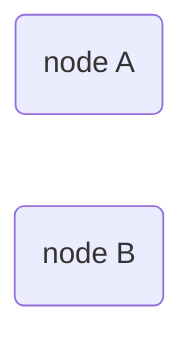
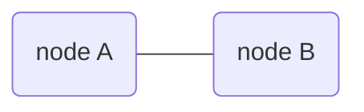
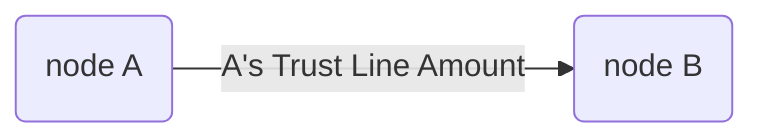
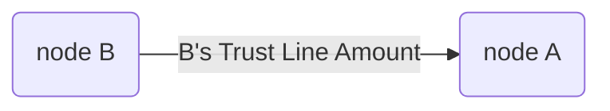

Quantum-resistant crypto-protocol for consistent state sharing.  
`GEO Protocol / 2018` `Draft`
<br/>
<br/>
<br/>
[`Dima Chizhevsky`](https://github.com/haysaycheese/) 
[`Mykola Ilashchuk`](https://github.com/MukolaIlashchuk) 
[`Max Demiyan`](https://github.com/MaxDemyan) 
<br/>
<br/>
<br/>
<br/>
<br/>

# Abstract
This specification describes algorithm _("Algorithm"_ further in the doc.) for the [GEO Network](https://github.com/GEO-Project). Proposed solution provides ability for 2 participants to share common state of a trust line / channel and syncronise it with quantum resistant proof of operations performed.

<br/>
<br/>
<br/>
<br/>

# Overview
The objectives of this document are:
1. to provide comprehensive info about proposed method of consensus;
1. to describe the method of mathematical and cryptographic confirmation of operations [#todo: add math proof];
1. to prodive mathematical confirmation of the impossibility (or extreme complexity) of the operations compromising [#todo: add math proof];
1. to provide a list of possible edge cases and to describe the ways to avoid/resovle them, as well as possible outcomes of operations.

<br/>
<br/>

# Source Conditions and Requirements
This section lists the functional and design requirements for the Algorithm.

**1. Requirements for cryptographic primitives:**
1. _Quantum-resistant cryptography._  
  _Algorithm_ **must** be avare of usage of cryptographic solutions, which are potentially [easily compromised in quantum-based environment](https://csrc.nist.gov/Projects/Post-Quantum-Cryptography) (RSA / ECDSA, and other solutions that are based on similar mathematical problems).  
  
1. _Strict minimum of crypto-primitives._  
  _Algorithm_ **must** use strict minimum of the crypto systems. The role of each of them must be strictly defined and clearly motivated. 


**2. Requirements for end-point devices (nodes):**
1. _Applicability for modern smartphones._  
  _Algorithm_ **must** be usable in environments with limited computing resources and memory. Operations data on a stable storage **must** fit into less than `200 Mb` per trust line.
  
1. _Computational efficiency._  
  _Algorithm_ **must** have low computational complexity. The mechanism for achieving consensus on a trust line's state **must** avoid frequent calling of complex cryptographic operations (as, for example, Proof Of Work mechanics assumes in some blockchain-based solutions).


**3. Requirements for network resources:**
1. _Resistance to unstable networks._  
  _Algorithm_ **must** be resistant to network interference, packets loss and/or even whole messages loss.
  
1. _Transport protocol agnostic._  
  _Algorithm_ **must not** require a permanent connection and must not be base its own mechanics on the guarantees provided by different protocols, starting with the transport layer of the OSI model (for example, TCP).


**4. Requirements for data transfers security:**
1. _Resistance for traffic sniffing_
  _Algorithm_ **must** encrypt data that passes between the nodes in end2end manner. 


**5. Requirements for fault tolerance:**
1. _Algorithm_ **must** perform operations even in cases when network connection is absent and automatically sync trust lines states on connection restore.


**6. Requirements for portability:**
1. _Algorithm_ **must not** contain platform-dependent components.
1. _Algorithm_ **must not** be hardware-dependent.

</br>
</br>

# Cryptographic Primitives
This _Algorithm_ is based on Lamport One Time Signature Scheme [#todo: link], BLAKE2b [#todo: link] hash function and AES256-GCM. [#todo: link]. Please, read about proposed implementation of Lamport Scheme on top BLAKE2b, AES256-GCM usage and motivation for inclidung of this cryptoprimitives into the protocol here. [#todo: link]

</br>
</br>

# Assumptions
1. _Algorithm_ expects only 2 participants to be involved. 
1. _Algorithm_ expects that both participants have _secret key_, retrieved before secret channel establishing. _Secret key_ might be different on each patricipant's side.    

**Related specs**
Crypto primitives; [#todo: add link]
Economic model; [#todo: add link]  

</br>
</br>

# Protocol Decription
## Overview
Lets assume there are 2 netwotk participants: `node A` and `node B`:




_Algorithm_ must provide the possibility to perform the next operations:
* [Create secured communication channel]() [#todo];
* [Create outgoin Trust Line]() [#todo];
* [Accept incoming Trust Line]() [#todo];
* [Verify the state of the Trust Line]() [#todo];
* [Reject incoming Trust Line]() [#todo];
* [(Re)Set the Trust Line amount(s)]() [#todo];
* [Change the balance of the Trust Line]()  [#todo].

</br>

## Create Secured Communication Channel
_Secured communication channel_ is used for p2p data transfers between participants in end2end manner. Messages are encrypted by the [_secret key_]() [#todo: add link to the key].




</br>

## Create Outgoin Trust Line
From `node A` perspective: **outgoing** [Trust Line]() [#todo: add link] to the `node B` looks like follows:




</br>
</br>

From `node B` perspective: **outgoing** [Trust Line]() [#todo: add link] to the `node A` looks like follows:




</br>

## Accept incoming Trust Line
Incoming [Trust Line]() [#todo: add link] is the mirror of the outgoing [Trust Line]() [#todo: add link] on the contractor's side. Incoming [Trust Line]() [#todo: add link] **must** be sycnronised with the outgoing [Trust Line]() [#todo: add link] on the counterpart side. 

</br>

## Verify the state of Trust Line
_Algorithm_ **must** force the parties to sync. their [Trust Lines]() [#todo: add link] and ensure that no one operation is possible/done in insecure manner. 

</br>
</br>

# Roles and entities
## Trust Line
_Trust Line_ is an accounting primitive, that stores incoming trust amount, outgoing turst amount and balance between this two, after each one operaton. 

```c++
using TrustLineAmount = uint256;
using TrustLineBalance = int256;
using EquivalentID = uint16;

struct TrustLine {
    TrustLineAmount incomingtrustAmount;
    TrustLineAmount outgoingTrustAmount;
    TrustLineBalance balance;
    EquivalentID equivalentID;
}
```

_Trust Lines_ plays the fundamental role in [GEO Network]() processing and participants intercomunnications. The purpose of the network itself is to atomically process the changes on several trust lines, involved into the common operation. Please, see the [Transactions Algorithm](https://github.com/GEO-Protocol/specs-protocol/blob/master/transactions/transactions.md) for the details.

</br>

### Trust Lines Equivalents
`equivalentID` is used to distinquish which [accounting unit]() [#todo: link] doest trust line support and, consequently, in which accounting unit it provides ability to process the operations.  

`equivalentID` relates to the external publicly available [Equivalents Registry]() [#todo: provide link]. Each one pair of nodes might have several _Trust Lines_ open in various equivalents. It is **forbidden** to open more than one trust lines with the same equivalent.

</br>

### Trust Lines Directions
_Trust Line_ might be _one-directional_ and _bi-directional_.

##### One-diretctional Trust Line
One-diretctional _Trust Line_ represents trust flow from one node to another one without any backward trust flow, for example, only from `node A` to the `node B`. In this case, trust lines configurations might be as follows:

```
### node A:
OtgoingTrustAmount: N
IncomingTrsutAmount: 0
Balance: 0

### node B:
OtgoingTrustAmount: 0
IncomingTrsutAmount: N
Balance: 0
```

There is also one another case, when `node B` trusts `node A` some amount without any backaward trust flow. In this case trust lines configurations might be as follows:

```
### node A:
OtgoingTrustAmount: 0
IncomingTrsutAmount: N
Balance: 0

### node B:
OtgoingTrustAmount: N
IncomingTrsutAmount: 0
Balance: 0
```


##### Bi-diretctional Trust Line
Bi-diretctional _Trust Line_ represents trust flows in both sides. In case when 2 nodes trusts to each other (not necessarily the same amount), instead of 2 one-directional trust lines, only one trust line should be created. In this case, trust lines configurations might be as follows:

```
### node A:
OtgoingTrustAmount: K
IncomingTrsutAmount: N
Balance: 0

### node B:
OtgoingTrustAmount: N
IncomingTrsutAmount: K
Balance: 0
```

Bi-diretctional _Trust Lines_ are way more efficient in case of bi-directed trust flows for the next reasons:
* Only one common [keys pool]() [#todo: add link] is used.
* Simpler accounting and audit logic.
* Less space usage on the node's devices.

</br>
</br>

## Keys Pool
Each one operation on the [_Trust Line_]() [#todo: link] **must** be signed by both parties, to prevent any possibility for the cheating. Operation **must** be considered as _incomplete_, until signatures of both sides would not present under the operation record, and **must** be considered as complete in case if both signatures are present **AND** both are valid. To provide possiblity to sign the operations by the nodes — _Keys Pools_ are used by the nodes. 

_Keys Pool_ — chain of the **public** keys of the counterpart node, related to the trust line with this node, and **public AND private** keys of it's own. For each one _Trust Line_ open, nodes **must** ensure it's _Keys Pool_. For example, in case if `node A` and `node B` has common trust line, `node A` would store public keys of the `node B`, related to the trust line between them, and `node B` would store public keys of the `node A` on it's side in the same way. Also, both sides would store it's private keys for each one public key that was not used yet.

Due to the used [crypto system]() [#todo: add link to the Lamport Crypto], each one operation **must** use it's own key, so, to be able to process several operations, — nodes **must** establish keys pools of appropriate size. Depending to the node [configuration]() [#todo: add link] keys pools might be from several keys long up to several thouthands keys long.

The pool format is the next:

```
Num.  | PKey (16Kb)     | PubKey (16Kb)                             
      |                 |
00001 | 6b 62 ... ce 81 | d3 86 ... 3c 47
00002 | 74 2d ... ae 7c | c5 e0 ... 26 96
      |                 |
 ...  |       ...       |       ...
      |                 |
  N   | e2 8c ... ea 63 | 54 72 ... f9 3b
```

∀ `pool` ∈ `KeyPools`:
* **must** be [hashed]() [todo: link to the hash algorithm] to prevent manipuldations with keys numbers.

</br>

### Keys Pools Size Prediction
Due to the key pool record format, one record is `16k + 16k + 2 = 32kB + 2` bytes long. The size of the signature, that **must** be stored to the related record in the pool is `8kB`. So, in total, one record might be `40kB + 2B` long. Optionally, the `PKay` of the operation should be removed from the `pool` to prevent its double usage in the future, so the record size might be reduced to `40k - 16k + 2 = 24k + 2` bytes.

So, for the Trust Lines with the 100 keys in pool,  be ~`24kB * 100 = 2400Kb == 24Mb`.

</br>
</br>

# Todo (describe):
1. Secret Key refresh
2. Operations flow
3. Set and pool hashing
4. Pools reinitialisation / additional keys generration
4. Proofs of operations can't be cheated.
5. Accept incoming Trust Line;

* Reject incoming Trust Line;
* (Re)Set the Trust Line amount(s).
* Change the balance of the Trust Line.
