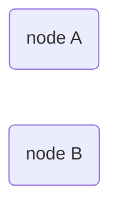
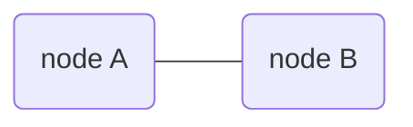
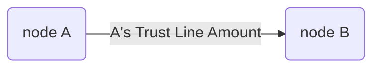
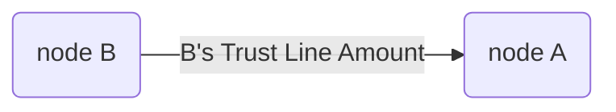

Quantum-resistant crypto-protocol for consistent state sharing.  
`GEO Protocol / 2018` `Draft`
 
 
 
[`Dima Chizhevsky`](https://github.com/haysaycheese/) 
[`Mykola Ilashchuk`](https://github.com/MukolaIlashchuk) 
[`Max Demiyan`](https://github.com/MaxDemyan) 
 
 
 
 
 

# Abstract
This specification describes algorithm _("Algorithm"_ further in the doc.) for the [GEO Network](https://github.com/GEO-Project). Proposed solution provides ability for 2 participants to share common state of a trust line / channel and syncronise it with quantum resistant proof of operations performed.

 
 
 
 

# Overview
The objectives of this document are:
1. to provide comprehensive info about proposed method of consensus;
1. to describe the method of mathematical and cryptographic confirmation of operations [#todo: add math proof];
1. to prodive mathematical confirmation of the impossibility (or extreme complexity) of the operations compromising [#todo: add math proof];
1. to provide a list of possible edge cases and to describe the ways to avoid/resovle them, as well as possible outcomes of operations.

 
 

# Source Conditions and Requirements
This section lists the functional and design requirements for the Algorithm.

**1. Requirements for cryptographic primitives:**
1. _Quantum-resistant cryptography._  
  _Algorithm_ **must** be avare of usage of cryptographic solutions, which are potentially [easily compromised in quantum-based environment](https://csrc.nist.gov/Projects/Post-Quantum-Cryptography) (RSA / ECDSA, and other solutions that are based on similar mathematical problems).  
  
1. _Strict minimum of crypto-primitives._  
  _Algorithm_ **must** use strict minimum of the crypto systems. The role of each of them must be strictly defined and clearly motivated. 

**2. Requirements for end-point devices (nodes):**
1. _Applicability for modern smartphones._  
  _Algorithm_ **must** be usable in environments with limited computing resources and memory. Operations data on a stable storage **must** fit into less than `200 Mb` per trust line.
  
1. _Computational efficiency._  
  _Algorithm_ **must** have low computational complexity. The mechanism for achieving consensus on a trust line's state **must** avoid frequent calling of complex cryptographic operations (as, for example, Proof Of Work mechanics assumes in some blockchain-based solutions).

**3. Requirements for network resources:**
1. _Resistance to unstable networks._  
  _Algorithm_ **must** be resistant to network interference, packets loss and/or even whole messages loss.
  
1. _Transport protocol agnostic._  
  _Algorithm_ **must not** require a permanent connection and must not be base its own mechanics on the guarantees provided by different protocols, starting with the transport layer of the OSI model (for example, TCP).

**4. Requirements for data transfers security:**
1. _Resistance for traffic sniffing_
  _Algorithm_ **must** encrypt data that passes between the nodes in end2end manner. 

**5. Requirements for fault tolerance:**
1. _Algorithm_ **must** perform operations even in cases when network connection is absent and automatically sync trust lines states on connection restore.

**6. Requirements for portability:**
1. _Algorithm_ **must not** contain platform-dependent components.
1. _Algorithm_ **must not** be hardware-dependent.

 
 

# Cryptographic Primitives
This _Algorithm_ is based on Lamport One Time Signature Scheme [#todo: link], BLAKE2b [#todo: link] hash function and AES256-GCM. [#todo: link]. Please, read about proposed implementation of Lamport Scheme on top BLAKE2b, AES256-GCM usage and motivation for inclidung of this cryptoprimitives into the protocol here. [#todo: link]

 
 

# Assumptions
1. _Algorithm_ expects 2 participants to be involved. 
1. _Algorithm_ expects that both participants have secret key, retrieved before secret channel establishing.  

**Related specs**
Crypto primitives; [#todo: add link]
Economic model; [#todo: add link]  

 
 

# Protocol Decription
## Overview
Lets assume there are 2 netwotk participants: `node A` and `node B`:

_Algorithm_ must provide us with the possibility to perform the next operations:

##### Create secured communication channel
_Secured communication channel_ is used for p2p data transfers in end2end manner. Messages are encrupted by shard secret key. [#todo: add link to the key].

##### Create outgoin Trust Line

From `node A` perspective: **outgoing** trust line to the `node B`:

 
 

From `node B` perspective: **outgoing** trust line to `node A`:

##### Accept incoming Trust Line

##### Verify the state of Trust Line

# Terms
##### Trust Line [# todo]

# Todo (describe):
1. Secret Key refresh
